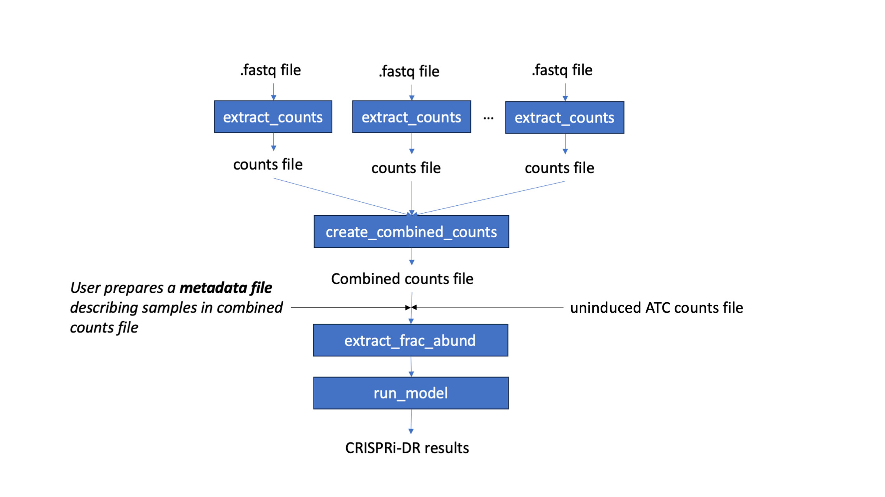

.. rst-class:: transit_clionly

.. _cgi:

CRISRi-DR
==========
CRISPRi-DR is designed to analyze CRISPRi libraries from CGI experiments and identify significant CGIs ie genes that affect sensitivity to the drug when depleted. 
[REF: TBA]

Workflow
--------
Starting with fastq files, barcode counts are extracted. The user create their own metadata file, for the counts extracted. The counts and metadata are used to run the CRISPRi-DR model. The output of this model is a files that lists genes with their statistacal parameters and significance. *Genes with sig interactions are those with qval<0.05 and |Z|>2 on the slope coeffcient* 

**Preprocessing: Fastq to Count Files**

This is a longer process, taking a few minutes. However, the number of reads processed is printed to the console to indicate progress
::

    > python3 ../src/transit.py CGI extract_counts <fastq_file> <ids_file> > <counts_file>

* ids_file : List of sgRNAs used in the experiment, where each row is one sgRNA id. 
    * For H37Rv experiments, the ids file is available in : *transit/src/pytransit/data/CGI/IDs.H37Rv.CRISPRi.lib.txt*

**Step 1: Combine Individual Counts File to a Combined Counts File**
This is a fairly fast process. It takes atmost a minute for the combination of 4 files.
::
    > python3 ../src/transit.py CGI combined_counts <comma seperated headers> <counts file 1> <counts file 2>  ... <counts_file n> > <combined counts file>

* comma-separated headers: must be in order of the columnd of the count files(s)
* counts files : sgRNA ids as their first column, and can have any number of columns. 

**Step 2: Extract Fractional Abundances**

This step is to turn the barcodes extracted into relative normalized abundances. These are normalized within samples, relative to the abundances in the ATC-induced 0-concentration file (the <no_depletion_abundances_file>), essentially fractions. This is a relatively quick process, taking less than a minute.
::
    > python3 ../src/transit.py CGI extract_abund <combined counts file> <counts metadata file> <reference condition> <sgRNA strengths file> <uninduced ATC file> <drug> <days>  >  <fractional abundance file>

* counts metadata file (USER created):

    * The columns expected in this file: column_name,drug,conc_xMIC,days_predepletion

        * column_name: the corresponding header name(s) in the combined counts file
        * You do not need equal number of replicates for all concentrations
        * see [Li, S et al. 2022, PMID: 35637331] for explanation of days_predepletion

    * Example metadata: *transit/src/pytransit/data/CGI/ShuquiCGI_metadata.txt* 

* reference condition: the condition to calculate relative abundances from as specificed in the "drug" column of the metadata file; typically an ATC-induced, no drug concentration.

* sgRNA strengths file: A file that contains metadata for each sgRNA in the combined counts file

    * It can have many columns but the first must be sgRNA id (as seen in the combined counts file) and the last column must be the strength measurement of the sgRNAs (in publication, extrapolated LFCs calculated through a passaging experiment is used).

* uninduced ATC file: A two column file of sgRNAs and their abundances in -ATC-induced (no ATC) with 0 drug concentration 

* drug : Name of the drug in the "drug" column of the metadata file passed in to be fit in the model

* days: Sampled from predepletion day as listed in the "days_predepletion" column of the metadata file to be used in the analysis

**Step 3: Run the CRISPRi-DR model**

This is a relatively quick process, taking at most 3 minutes for a dataset of ~90,000 sgRNAs . This step fits the CRISPRi-DR model (statistical analysis of concentration dependence for each gene) to each gene in the file and prints each output to the <CRISPRi-DR results file> in a tab seperated file. 
::

    > python3 ../src/transit.py CGI run_model <fractional abundance file>  >  <CRISPRi-DR results file>

* Siginificant interacting genes are those with adjusted P-val (Q-val) < 0.05 and \|Z slope\| > 2, these are indicated by a "-1" for depleted and "1" for enriched in in the "Significant Interactions" column

**Visualize Specific Genes**

This process is fairly quick, taking less than a minute to run. This figure visualizes the amount of depletion in a gene at the sgRNA level. The slope of relative abundance (fraction of abundance of counts in ATC induced vs. ATC uninduced) versus log2(concentration) for each sgRNA is calculated and plotted, colored by sgRNA strenght based on a blue-orange gradient (as seen here):

.. image:: _images/CGI_lmplot.png
  :width: 400
  :alt: Alternative text

::

    > python3 ../src/transit.py CGI visualize <fractional abundance file> <gene> <output plot location>

* fractional abundance file : Fractional abundance file as created in Step 2
* gene : select a gene to visualize. Use orf or gene name
* output plot location : The location where to save the generated plot.

Example
-------

Note that the first step requires some data files.
* ShiquiCGI_metadata.txt - describes the samples
* Bosch21_TableS2.txt - contains betaE estimates for each sgRNA
* Bosch21_TableS2_extended.txt - contains extrapolated LFCs for each sgRNA
* no_depletion_abundances.txt - pre-calculated abundance for -ATC (no induction of target depletion)

Preliminary step: download raw counts from github
  > git clone https://github.com/rock-lab/CGI_nature_micro_2022

  I suggest linking this in the local (CGI) directory as follows 
    (but I can go anywhere, and you provide the path to the data/counts/ dir on the command line for extract_abund)

  > ln -s CGI_nature_micro_2022/data data

usage: 
  python3 ../src/transit.py CGI extract_abund <metadata_file> <data_dir> <extrapolated_LFCs_file> <no_drug_file> <no_depletion_abundances_file> <drug> <days>  >  <output_file>
  python3 ../src/transit.py CGI run_model <abund_file>  >  <logsigmodfit_file>
  python3 ../src/transit.py CGI post_process <logsigmoidfit_file>  >  <results_file>

example of pipeline:

> python3 ../src/transit.py CGI extract_abund ShiquiCGI_metadata.txt data/counts/ Bosch21_TableS2_extended.txt counts_1972_DMSO_D5.txt no_depletion_abundances.txt RIF 5 > frac_abund.RIF_D5.txt

  gathers relevant samples (at all available concs, and DMSO representing 0xMIC)
  calculates fractional abundances (normalized within samples, relative to no-depletion abundances, essentially fractions)

> python3 ../src/transit.py CGI run_model frac_abund.RIF_D5.txt > logsigmoidfit.RIF_D5.txt

  runs linear regressions for a log-sigmoid model (in R)

> python3 ../src/transit.py CGI post_process logsigmoidfit.RIF_D5.txt > CGI_results.RIF_D5.txt

  outputs statistical analysis of concentration dependence for each gene
  can open as spreadsheet in Excel
  genes that interact significantly with drug are those with adjusted P-val (Q-val) < 0.05

python3 ../transit/src/transit.py CGI create_combined_counts DMSO_1,DMSO_2,DMSO_3,VAN_0_0625_1,VAN_0_0625_2,VAN_0_0625_3,VAN_0_125_1,VAN_0_125_2,VAN_0_125_3,VAN_0_25_1,VAN_0_25_2,VAN_0_25_3 CGI_nature_micro_2022/data/counts/counts_1952_DMSO_D10.txt CGI_nature_micro_2022/data/counts/counts_1953_VAN_0_0625X_D10.txt CGI_nature_micro_2022/data/counts/counts_1954_VAN_0_125X_D10.txt CGI_nature_micro_2022/data/counts/counts_1955_VAN_0_25X_D10.txt > combined_VAN_D10.txt

python3 ../transit/src/transit.py CGI extract_abund combined_VAN_D10.txt VAN_D10_metadata.txt DMSO ../transit/src/pytransit/data/CGI/Bosch21_TableS2_extended.txt ../transit/src/pytransit/data/CGI/no_depletion_abundances.txt VAN 10  >  VAN_D10_frac_abund.txt

python3 ../transit/src/transit.py CGI run_model VAN_D10_frac_abund.txt > logsig.txt