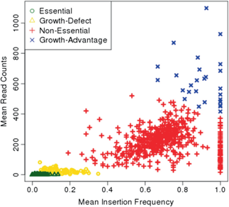

.. _HMM:

HMM
===

The HMM method can be used to determine the essentiality of the entire genome, as opposed to gene-level analysis of the other methods. It is capable of identifying regions that have unusually high or unusually low read counts (i.e. growth advantage or growth defect regions), in addition to the more common categories of essential and non-essential.

.. NOTE::
   Intended only for **Himar1** datasets.

|

How does it work?
-----------------

| For a formal description of how this method works, see our paper [DeJesus2013HMM]_:
|
|  DeJesus, M.A., Ioerger, T.R. `A Hidden Markov Model for identifying essential and growth-defect regions in bacterial genomes from transposon insertion sequencing data. <http://www.ncbi.nlm.nih.gov/pubmed/24103077>`_ *BMC Bioinformatics.* 2013. 14:303

|

Usage
-----

::

  > python3 transit.py hmm <comma-separated .wig files> <annotation .prot_table or GFF3> <output_BASE_filename>
        (will create 2 output files: BASE.sites.txt and BASE.genes.txt)

        Optional Arguments:
            -r <string>     :=  How to handle replicates. Sum, Mean. Default: -r Mean
            -l              :=  Perform LOESS Correction; Helps remove possible genomic position bias. Default: Off.
            -iN <float>     :=  Ignore TAs occuring at given percentage (as integer) of the N terminus. Default: -iN 0
            -iC <float>     :=  Ignore TAs occuring at given percentage (as integer) of the C terminus. Default: -iC 0

Parameters
----------

The HMM method automatically estimates the necessary statistical
parameters from the datasets. You can change how the method handles
replicate datasets:

-  **Replicates:** Determines how the HMM deals with replicate datasets
   by either averaging the read-counts or summing read counts across
   datasets. For regular datasets (i.e. mean-read count > 100) the
   recommended setting is to average read-counts together. For sparse
   datasets, it summing read-counts may produce more accurate results.

|

Output and Diagnostics
----------------------

| The HMM method outputs two files. The first file (**BASE.sites.txt**) provides the most
  likely assignment of states for all the TA sites in the genome. Sites
  can belong to one of the following states: "E" (Essential), "GD"
  (Growth-Defect), "NE" (Non-Essential), or "GA" (Growth-Advantage). In
  addition, the output includes the probability of the particular site
  belonging to the given state. The columns of this file are defined as
  follows:

+------------+-----------------------------------------------------------------------------------------------------+
| Column #   | Column Definition                                                                                   |
+============+=====================================================================================================+
| 1          | Coordinate of TA site                                                                               |
+------------+-----------------------------------------------------------------------------------------------------+
| 2          | Observed Read Counts                                                                                |
+------------+-----------------------------------------------------------------------------------------------------+
| 3          | Probability for ES state                                                                            |
+------------+-----------------------------------------------------------------------------------------------------+
| 4          | Probability for GD state                                                                            |
+------------+-----------------------------------------------------------------------------------------------------+
| 5          | Probability for NE state                                                                            |
+------------+-----------------------------------------------------------------------------------------------------+
| 6          | Probability for GA state                                                                            |
+------------+-----------------------------------------------------------------------------------------------------+
| 7          | State Classification (ES = Essential, GD = Growth Defect, NE = Non-Essential, GA = Growth-Defect)   |
+------------+-----------------------------------------------------------------------------------------------------+
| 8          | Gene(s) that share(s) the TA site.                                                                  |
+------------+-----------------------------------------------------------------------------------------------------+

|
|  The second file (**BASE.genes.txt**) provides a gene-level classification for all the
  genes in the genome. Genes are classified as "E" (Essential), "GD"
  (Growth-Defect), "NE" (Non-Essential), or "GA" (Growth-Advantage)
  depending on the number of sites within the gene that belong to those
  states.

+-------------------+-----------------------------------------------------------------------------------------------------+
| Column Header     | Column Definition                                                                                   |
+===================+=====================================================================================================+
| Orf               | Gene ID                                                                                             |
+-------------------+-----------------------------------------------------------------------------------------------------+
| Name              | Gene Name                                                                                           |
+-------------------+-----------------------------------------------------------------------------------------------------+
| Desc              | Gene Description                                                                                    |
+-------------------+-----------------------------------------------------------------------------------------------------+
| N                 | Number of TA sites                                                                                  |
+-------------------+-----------------------------------------------------------------------------------------------------+
| n0                | Number of sites labeled ES (Essential)                                                              |
+-------------------+-----------------------------------------------------------------------------------------------------+
| n1                | Number of sites labeled GD (Growth-Defect)                                                          |
+-------------------+-----------------------------------------------------------------------------------------------------+
| n2                | Number of sites labeled NE (Non-Essential)                                                          |
+-------------------+-----------------------------------------------------------------------------------------------------+
| n3                | Number of sites labeled GA (Growth-Advantage)                                                       |
+-------------------+-----------------------------------------------------------------------------------------------------+
| Avg. Insertions   | Mean insertion rate within the gene                                                                 |
+-------------------+-----------------------------------------------------------------------------------------------------+
| Avg. Reads        | Mean read count within the gene                                                                     |
+-------------------+-----------------------------------------------------------------------------------------------------+
| State Call        | State Classification (ES = Essential, GD = Growth Defect, NE = Non-Essential, GA = Growth-Defect)   |
+-------------------+-----------------------------------------------------------------------------------------------------+

|
|  Note: Libraries that are too sparse (e.g. < 30%) or which contain
  very low read-counts may be problematic for the HMM method, causing it
  to label too many Growth-Defect genes.

|

Run-time
--------

| The HMM method takes less than 10 minutes to complete. The parameters
  of the method should not affect the running-time.

|

HMM Confidence Scores (Oct 2023)
---------------------

One of the difficulties in assessing the certainties of the HMM calls
is that, while the formal state probabilities are calculated at
individual TA sites, the essentiality calls at the gene level are made
by taking a vote (the most frequent state among its TA sites), and
this does not lend itself to such formal certainty quantification.
However, the reviewers’ question prompted us to devise a novel
approach to evaluating the confidence of the HMM calls for genes.  In
the output files, we include the local saturation and mean insertion
count for each gene, along with the gene-level call and state
distribution.  We have sometimes noticed that short genes are
susceptible to being influenced by the essentiality of an adjacent
region, which is evident by examining the insertion statistics.  For
example, consider a hypothetical gene with just 2 TA sites that is
labeled as ES by the HMM but has insertions at both sites.  It might
be explained by proximity to a large essential gene or region, due to
the “smoothing” the HMM does across the sequence of TA sites.  Thus we
can sometimes recognize inaccurate calls by the HMM if the insertion
statistics of a gene are not consistent with the call.

In our paper on the HMM in Transit `(DeJesus et al, 2013)
<https://pubmed.ncbi.nlm.nih.gov/24103077/>`_, 
we showed a 2D plot of the posterior distribution of
saturation and mean insertion counts (for a high-quality 
TnSeq reference dataset) for the 4 essentiality states, which demonstrates that
genes are nicely clustered, with ES genes having near-0 saturation and
low counts at non-zero sites, NE genes have high saturation and
counts, GD genes fall in between, and GA genes are almost fully
saturated with excessively high counts.

(Figure 5 from `(DeJesus et al, 2013) <https://pubmed.ncbi.nlm.nih.gov/24103077/>`_ ) 

We now calculate the distributions of insertion statistics **for each
dataset** on which the HMM is run, 
and use it to assess the confidence in each of the essentiality calls.
We start by calculating the mean and standard
deviation of saturation and insertion count over all the genes in each
of the 4 states (ES, GD, NE, and GA).  Then, for each gene, we compute
the probability density of its local statistics with respect to the
product of Normal distributions for its called state.  For example,
suppose a gene g is called state s.  Then:

::

     conf(g|s) = N(sat(g)|μ_sat(s), σ_sat(s)) * N(cnt(g)|μ_cnt(s), σ_cnt(s))

This models the joint probability of the distribution of saturation
and insertion counts for each class (simplistically) as independent,
effectively forming “rectangular” regions around each cluster.  We can
then calculate the probability that the gene belongs to each state
based on these posterior distributions, and normalize them to sum
to 1.  Finally, the “confidence” of the HMM call for each gene is the
normalized probability of the gene’s insertion statistics given the
posterior distribution for that essentiality state.

This confidence score nicely identifies genes of low confidence, where
the local saturation and mean insertion count seem inconsistent with
the HMM call.  The low-confidence genes are biased toward short genes
(with 1-3 TA sites), though they include some large genes with many TA
sites as well.  Some of the former are cases where the call of a short
gene is influenced by an adjacent region.  Some of the latter include
ambiguous cases like multi-domain proteins, where one domain is
essential and the other is not.  We observed that there are often
“borderline” (or ambiguous) genes, which the HMM labels as one state,
but which are more consistent with a similar state.  For example, in
some cases, a low-confidence ES gene might have a higher posterior
probability of GD, based on insertion statistics.  Other cases include
ambiguities between NE and GD, or NE and GA, especially for genes with
mean insertion counts on the border between the clusters (posterior
distributions) in the 2D plot.  After identifying and removing these
borderline genes (also now indicated in the HMM output files), we find
that most of the low-confidence genes have confidence scores in the
approximate range of 0 to 0.25.  The number of low-confidence genes
can range from a few hundred up to a thousand
(for which the predicted essentiality call should be ignored), 
depending on the
saturation of the input dataset (.wig file); less-saturated datasets
tend to have more low-confidence genes.

We implemented this procedure as a stand-alone **post-processing script**
(called '**HMM_conf.py**' in the src/ directory) which is run on HMM output files,
calculates a “confidence” score for each gene
and appends this information as extra columns to the HMM output file.
(In the future, it will be integrated directly into the HMM output,
obviating the need for a second step.)

::

  usage: python3 src/HMM_conf.py <HMM_output.genes.txt>

  example: 

  > python HMM_conf.py HMM_Ref_sync3_genes.txt > HMM_Ref_sync3_genes.conf.txt

The script adds the following columns:

 * **consis** - consistency (proportion of TA sites representing the majority essentiality state)
 * **probES** - conditional probability (unnormalized) of the insertions statistics (sat and mean) if the gene were essential 
 * **probGD** - conditional probability (unnormalized) of the insertions statistics (sat and mean) if the gene were growth-defect
 * **probNE** - conditional probability (unnormalized) of the insertions statistics (sat and mean) if the gene were non-essential
 * **probGA** - conditional probability (unnormalized) of the insertions statistics (sat and mean) if the gene were growth-advantaged
 * **conf** - confidence score (normalized conditional joint probability of the insertion statistics, given the actual essential call made by the HMM)
 * **flag** - genes that are ambiguous or have low confidence are labeled as such
  * *low-confidence* means: the HMM call is inconsistent with statistics of insertion counts in gene, so the HMM call should be ignored
  * *ambiguous* means: the HMM gives high probability to 2 adjacent essentiality states, like ES-or-GD, or GD-or-NE; these could be borderline cases where the gene could be in either category

If consistency<1.0, it means not all the TA sites in the gene agree with the essentiality call, which is made by majority vote. 
It is OK if a small fraction of TA sites in a gene are labeled otherwise.
If it is a large fraction (consistency close to 50%), it might be a 'domain-essential'
(multi-domain gene where one domain is ES and the other is NE).

Here is an example to show what the additional columns look like.
Note that MAB_0005 was called NE, but only has insertions at 1 out of 4 TA sites
(sat=25%) with a mean count of only 7, so it is more consistent with ES; hence it is
flagged as low-confidence (and one should ignore the NE call).

Note!!! *The extra column headers still need to be added to HMM_conf.py: cons
probES probGD probNE probGA conf flag.*

::

  # avg gene-level consistency of HMM states: 0.9894
  # state posterior probability distributions:
  #  ES: genes=364, meanSat=0.038, stdSat=0.075, meanNZmean=12.0, stdNZmean=61.1
  #  GD: genes=146, meanSat=0.297, stdSat=0.227, meanNZmean=9.6, stdNZmean=16.0
  #  NE: genes=3971, meanSat=0.816, stdSat=0.169, meanNZmean=147.4, stdNZmean=110.7
  #  GA: genes=419, meanSat=0.923, stdSat=0.11, meanNZmean=393.3, stdNZmean=210.0
  #HMM - Genes
  #command line: python3 ../../transit/src/transit.py hmm TnSeq-Ref-1.wig,TnSeq-Ref-2.wig,TnSeq-Ref-3.wig abscessus.prot_table HMM_Ref_sync3.txt -iN 5 -iC 5
  #summary of gene calls: ES=364, GD=146, NE=3971, GA=419, N/A=23
  #key: ES=essential, GD=insertions cause growth-defect, NE=non-essential, GA=insertions confer growth-advantage, N/A=not analyzed (genes with 0 TA sites)
  #ORF     gene annotation                                TAs ES sites GD sites NE sites GA sites saturation   mean call consis probES  probGD   probNE   probGA   conf   flag
  MAB_0001 dnaA Chromosomal replication initiator protein 24  24       0         0        0       0.0417       1.00 ES   1.0  0.22865 0.025725 0.000515 0.000169 0.8965
  MAB_0002 dnaN DNA polymerase III, beta subunit (DnaN)   13  13       0         0        0       0.0769       1.00 ES   1.0  0.13582 0.028284 0.000536 0.000175 0.8241
  MAB_0003 gnD  6-phosphogluconate dehydrogenase Gnd      19   0       0        19        0       0.9474      81.33 NE   1.0  0.00000 0.000000 0.001181 0.000329 0.7870
  MAB_0004 recF DNA replication and repair protein RecF   15   0       0        15        0       0.6667      80.80 NE   1.0  0.00000 0.000000 0.001175 0.000307 0.7926
  MAB_0005 -    hypothetical protein                       4   0       0         4        0       0.2500       7.00 NE   1.0  0.00000 0.052913 0.000661 0.000207 0.0123 low-confidence
  MAB_0006 -    DNA gyrase (subunit B) GyrB               30  30       0         0        0       0.0000       0.00 ES   1.0  0.12864 0.020461 0.000487 0.000161 0.8590
  MAB_0007 -    Hypothetical protein                      24   0       0         0       24       0.9167     456.64 GA   1.0  0.00000 0.000000 0.000145 0.000433 0.7487
  MAB_0008 -    Hypothetical protein                       3   0       0         0        3       0.6667     173.00 GA   1.0  0.00000 0.000000 0.780528 0.219472 0.2195 low-confidence
  MAB_0009 -    Hypothetical protein                       6   0       0         0        6       1.0000     495.83 GA   1.0  0.00000 0.000000 0.157296 0.842704 0.8427 
  MAB_0010c -   Hypothetical protein                      14   0       0         0       14       0.9286     390.08 GA   1.0  0.00000 0.000000 0.435214 0.564786 0.5648 ambiguous
  ...

.. rst-class:: transit_sectionend
----
