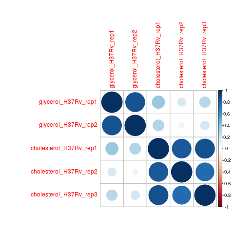
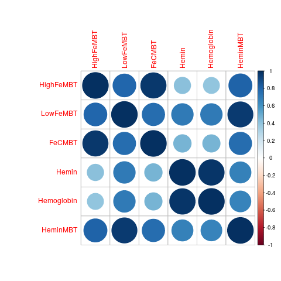

.. _corrplot:

.. rst-class:: transit_clionly
corrplot
========

A useful tool when evaluating the quality of a collection of TnSeq datasets is to make a
*correlation plot* of the mean insertion counts (averaged at the gene-level) among samples.
While it is difficult to state unequivocally
how much correlation there should be between samples from different conditions
(or even between replicates of the same condition),
the corrplot can often reveal individual samples which stand out as being far less
correlated with all the others (which subsequently might be excluded from analyses).

**Note**: The *corrplot* command calls R, which must be installed on your system,
and relies on the 'corrplot' R package.
See :ref:`Installation Instructions <install-zinb>`.

Usage:
------

::

  python3 src/transit.py corrplot <mean_counts> <output.png> [-anova|-zinb]

The simplest usage is without the flags at the end.
The mean_counts file is generated by the 'export mean_counts' command, and gives
the mean insertion count for each gene in each sample.

Here is an example of making a corrplot:

::

  > transit corrplot glyc_chol_combined.wig.txt glyc_chol_corrplot.png
  correlations based on 3990 genes

A corrplot can also be generated from the output of ANOVA or ZINB
analysis, showing relationships among the conditions themselves
(i.e. with replicates merged, rather than correlations among
individual samples).  Importantly, the correlations are based only on
the *subset* of genes identified as significantly varying (Padj <
0:05) in order to enhance the patterns, since otherwise they would be
washed out by the rest of the genes in the genome, the majority of
which usually do not exhibit significant variation in counts.

Here is an example which generates the following image showing the corrplot among
several different growth conditions:

::

  > python3 src/transit.py corrplot anova_iron.txt iron_corrplot_anova.png -anova
  correlations based on 229 genes

Note that if an ANOVA or ZINB output file (both of which contain mean
counts for each gene in each condition) is supplied in place of
mean_counts, the *last* argument of corrplot must be set to either
'-anova' or '-zinb' to indicate the type of file being provided as the
first argument.

Note: corrplot requires R (statistical analysis software)
to be installed on your system.  See :ref:`Installation Instructions <install-zinb>`.

.. rst-class:: transit_sectionend
----
