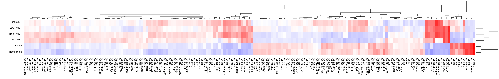

.. _heatmap:

.. rst-class:: transit_clionly
heatmap
=======

The output of ANOVA or ZINB can be used to generate a heatmap that
simultaneously clusters the significant genes and clusters the conditions,
which is especially useful for shedding light on the relationships
among the conditions apparent in the data.

**Note:** The *heatmap* command calls R, which must be installed on your system,
and relies on the 'gplots' R package.
See :ref:`Installation Instructions <install-zinb>`.

Usage:
------

::

  python3 src/transit.py heatmap <anova_or_zinb_output> <heatmap.png> -anova|-zinb [-topk <int>] [-qval <float] [-low_mean_filter <int>]

Note that the **third argument is required to be either '-anova' or '-zinb'**, 
which is a flag to indicate the type of file being provided as the second argument.

By default, genes are selected for the heatmap based on qval<0.05.
However, the user may change the selection of genes through 2 flags:

 * **-qval <float>**: change qval threshold for selecting genes (default=0.05)
 * **-topk <int>**: select top k genes ranked by significance (qval)
 * **-low_mean_filter <int>**: filter out genes with grand mean count (across all conditions) below this threshold (even if qval<0.05); default is to exclude genes with mean count<5

Here is an example which generates the following image showing the similarities among
several different growth conditions:

::

  > python3 src/transit.py heatmap anova_iron.txt heatmap_iron_anova.png -anova

Importantly, the heatmap is based only on the subset of genes
identified as *significantly varying* (Padj < 0:05, typically only a few
hundred genes) in order to enhance the patterns, since otherwise they would
be washed out by the rest of the genes in the genome, the majority of
which usually do not exhibit significant variation in counts.

.. rst-class:: transit_sectionend
----
