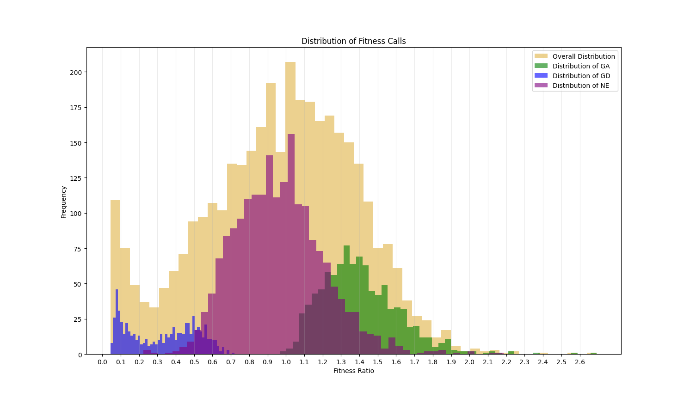

.. rst-class:: transit_clionly

===========
TTN-Fitness
===========

TTN-Fitness provides a method for estimating the fitness of genes in a single
condition, while correcting for biases in Himar1 insertion preferences at TA sites
based on surrounding nucleotides. The frequency of insertions depends on nucleotides
surrounding TA sites. This model captures that effect.

Typically with individual TnSeq datasets, Gumbel and HMM are the methods used for
evaluating essentiality. Gumbel distinguishes between ES (essential) from NE (non-essential).
HMM adds the GD (growth-defect; suppressed counts; mutant has reduced fitness) and
GA (growth advantage; inflated counts; mutant has selective advantage) categories.
Quantifying the magnitude of the fitness defect is risky because the counts at
individual TA sites can be noisy. Sometimes the counts at a TA site in a gene can span
a wide range of very low to very high counts. The TTN-Fitness gives a more fine-grained analysis
of the degree of fitness effect by taking into account the insertion preferences of the Himar1 transposon.

These insertion preferences are influenced by the nucleotide context of each TA site.  The TTN-Fitness
method uses a statistical model based on surrounding nucleotides to estimate the insertion bias of each site.
Then, it corrects for this to compute an overall fitness level as a Fitness Ratio, where the ratio is 0 for
ES genes, 1 for typical NE genes, between 0 and 1 for GD genes and above 1 for GA genes.

For additional details, see our paper:

`Choudhery, Sanjeevani et al. “Modeling Site-Specific Nucleotide Biases Affecting Himar1 Transposon Insertion
Frequencies in TnSeq Data Sets.” mSystems vol. 6,5 (2021): e0087621. doi:10.1128/mSystems.00876-21 <https://pubmed.ncbi.nlm.nih.gov/34665010/>`_

* This methodology is best suited for libraries created with the Himar1 transposon.
* The model itself does not need to be re-trained to make prediction on a dataset. Our data (Choudhery, 2021) shows
  this model generalizes across other bacterial species.
* This methodology can handle multiple replicates. More replicates increase the saturation of TA sites in non-essential
  genes. This allows for higher accuracy and precision of the insertion counts at TA sites of a genome.

Note that the TTN-Fitness model is primarily aimed at analyzing GD (growth-defect) genes (and NE, GA) in terms of magnitudes of counts,
but not really ES/ESB genes, which are determined by other analyses (based on absence of insertions). ES genes are
essential genes have been previously labeled as such by the Gumbel method. ESB genes
are genes that have no insertions and are are long enough to be significant by a Binomial
method (see paper).  Since counts are so close to 0 for these, the insertion biased on
the transposon is irrelevant.  Thus, the predictive model is not really used for these genes.

TTN-Fitness is more sensitive to deviations in insertion counts
(compared to expected insertion counts) and therefore tends to call
more GD and GA genes than other analysis methods.

On an average machine, running this methodology on a dataset takes about 5 minutes

Usage
------

::

  python3 transit.py ttnfitness <comma-separated .wig files> <annotation .prot_table> <genome .fna> <gumbel output file> <gene-wise output file> <ta-site wise output file>
  -  gumbel output file:* The Gumbel method must be run first on the dataset.The output of the Gumbel method is provided as an input
     to this method. ES (essential by Gumbel) and EB (essential by Binomial) is calculated in the TTN-Fitness method via this files

Output
------

There are two outputs files. One file details the assessment per gene and one details the assessment per TA site.

The first output file is a tab-delimited file where the last column, titled TTN-Fitness Calls reports the essentiality call of
each given gene. The call is one of following:

* NE = Non-essential.
* ES = essential based on Gumbel
* ESB = essential based on Binomial**
* GA = Growth Advantage
* GD = Growth Defect
* U = Uncertain [for genes that are too short]

** this is an alternative model for identifying essential genes that complements the Gumbel calculation, which tends to 
call short genes with few TA sites Uncertain, especially at lower levels of saturation; see Choudhery et al, 2021

The Fitness Ratio reported in this file is a modification of the M1 coefficient to reflect the amount of fitness defect per gene.
This ratio was calculated as:

.. math::

   Fitness \ Ratio = e^{(M1\ coefficient - median[M1\ coefficients])}

This value ranges from 0 to infinity.
Genes with a value around 1 are non-essential.
If less than 1, this value indicates the level of growth defect
that is caused by disruption of the gene by transpoon insertion.
The closer the ratio of a gene is to 0, the more essential a gene is.
If greater than 1, it indicates the level of growth advantage of the mutant.
The histograms below shows the distribution of the fitness ratios calculated
for each of the essentiality categories. The genes
assessed as GD have a ratio that is typically below 0.5,
those labeled GA are mostly above 1.0 and the ratios of genes assessed
as NE have a peak at 1 and are restricted to the center of the plot.

The Fitness Ratio quantifies the qualitative calls seen in the TTN-Fitness Calls Column. These two columns are the last two
columns in the output file and are the primary columns per gene reflecting the assessments made by our model.

+---------------------------+----------------------------------------------------------------------+
| Column Header             | Column Definition                                                    |
+===========================+======================================================================+
| Orf                       | Gene ID.                                                             |
+---------------------------+----------------------------------------------------------------------+
| Name                      | Name of the Gene                                                     |
+---------------------------+----------------------------------------------------------------------+
| Description               | Gene description                                                     |
+---------------------------+----------------------------------------------------------------------+
| Total # TA Sites          | Total number of TA sites in the Gene                                 |
+---------------------------+----------------------------------------------------------------------+
| #Sites with insertions    | Number of TA sites in the Gene with insertions                       |
+---------------------------+----------------------------------------------------------------------+
| Gene Saturation           | Percentage of TA sites in the Gene with insertions                   |
+---------------------------+----------------------------------------------------------------------+
| Gene+TTN (M1) Coef        | The coefficient of a given gene in M1 model                          |
+---------------------------+----------------------------------------------------------------------+
| Gene+TTN (M1) Adj Pval    | The BF adjusted p-value of a coef of a gene in M1                    |
+---------------------------+----------------------------------------------------------------------+
| Mean Insertion Count      | The mean insertion count at TA sites in a given gene                 |
+---------------------------+----------------------------------------------------------------------+
| **Fitness Ratio**         | **Adjusted M1 coefficients to quantify fitness defect per gene**     |
+---------------------------+----------------------------------------------------------------------+
| **TTN-Fitness Assessment**| **Calls made for a given gene using the M1 Coef and Adjusted Pval**  |
+---------------------------+----------------------------------------------------------------------+

The second output file is a tab-seperated file of details of the TTN Fitness method per TA Site.

+---------------------------+-------------------------------------------------------------------------------+
| Column Header             | Column Definition                                                             |
+===========================+===============================================================================+
| Coord                     | Coordinate of TA Site                                                         |
+---------------------------+-------------------------------------------------------------------------------+
| Orf                       | Gene ID                                                                       |
+---------------------------+-------------------------------------------------------------------------------+
| Name                      | Name of the Gene                                                              |
+---------------------------+-------------------------------------------------------------------------------+
| Uqstream TTN              | Nucleotides in position 1,2,3 and 4 from the TA site                          |
+---------------------------+-------------------------------------------------------------------------------+
| Downstream TTN            | Reverse Complement of Nucleotides in position -1,-2,-3 and -4 from the TA site|
+---------------------------+-------------------------------------------------------------------------------+
| TTN Fitness Assessment    | Fitness Call for the Gene                                                     |
+---------------------------+-------------------------------------------------------------------------------+
| Insertion Counts          | Number of Insertions at TA site                                               |
+---------------------------+-------------------------------------------------------------------------------+
| Local Average             | The average number of insertions +5 to -5 from the TA site                    |
+---------------------------+-------------------------------------------------------------------------------+
| M1 Predicted Counts       | TTN+gene based predictions at the TA site using TTN Fitness model             |
+---------------------------+-------------------------------------------------------------------------------+

Example of running the TTN-Fitness methodology on the sample glycerol data
--------------------------------------------------------------------------

1. Run the Gumbel Analysis
::
  python3 transit.py gumbel glycerol_H37Rv_rep1.wig,glycerol_H37Rv_rep2.wig H37Rv.prot_table gylcerol_H37Rv.gumbel.out

2. Use the output of the Gumbel Analysis as the input to the TTTN-Fitness method
::
  python3 transit.py ttnfitness glycerol_H37Rv_rep1.wig,glycerol_H37Rv_rep2.wig H37Rv.prot_table H37Rv.fna glycerol_H37Rv.gumbel.out ttnfitness_glycerol_H37Rv_gene.txt ttnfitness_glycerol_H37Rv_TAsite.txt

The resulting ttnfitness_glycerol_H37Rv_gene.txt out should contain TTN Fitness Assessments breakdown similar to:

* 172 ES
* 501 ESB
* 2680 NE
* 195 GA
* 359 GD
* 72 U

The resulting ttnfitness_glycerol_H37Rv_TAsite.txt should contain 62,622 TA sites

.. rst-class:: transit_sectionend
----
