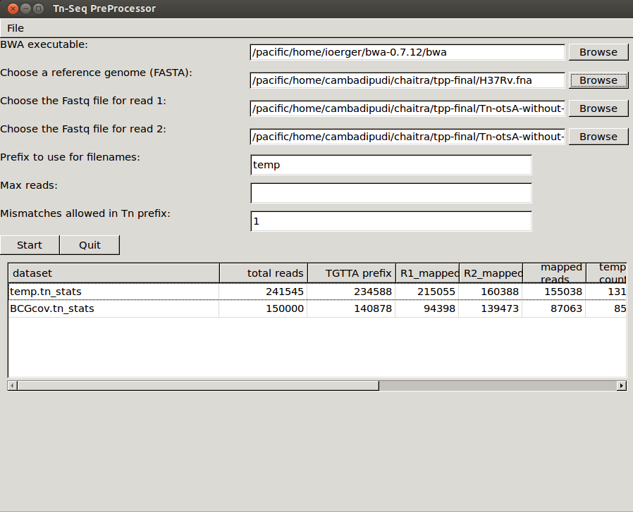

TPP Overview
============

TPP is a software tool for processing raw reads (e.g. .fastq files,
*untrimmed*) from an Tn-Seq experiment, extracting counts of transposon
insertions at individual TA dinucleotides sites in a genome ("read
counts", or more specifically "template counts", see below), and writing
this information out in
`.wig <http://genome.ucsc.edu/goldenpath/help/wiggle.html>`__ format
suitable for input to `TRANSIT <index.html>`__. In addition, TPP
calculates some useful statistics and diagnostics on the dataset.

There are many way to do pre-processing of Tn-Seq datasets, and it can
depend on the the protocol used for Tn-Seq, the conventions used by the
sequencing center, etc. However, TPP is written to accommodate the most
common situation among our collaborating labs. In particular, it is
oriented toward the Tn-Seq protocol developed in the Sassetti lab and
described in `(Long et al,
2015) <http://www.springer.com/biomed/human+genetics/book/978-1-4939-2397-7>`__,
which uses a barcoding system to uniquely identifying reads from
distinct transposon-junction DNA fragments. This allows raw read counts
to be reduced to unique **template counts**, eliminating effects of PCR
bias. The sequencing must be done in paired-end (PE) mode (with a
minimum read-length of around 50 bp). The transposon terminus appears in
the prefix of read1 reads, and barcodes are embedded in read2 reads.

The suffixes of read1 and read2 contain nucleotides from the genomic
region adjacent to the transposon insertion. These subsequences must be
mapped into the genome. TPP uses
`BWA <http://bio-bwa.sourceforge.net/>`__ (Burroughs-Wheeler Aligner) to
do this mapping. It is a widely-used tool, but you will have to install
it on your system. Mapping large datasets takes time, on the order of 15
minutes (depending on many factors), so you will have to be patient.

Subsequent to the BWA mapping step, TPP does a bunch of post-processing
steps. Primarily, it tabulates raw read counts at each TA site in the
reference genome, reduces them to template counts, and writes this out
in .wig format (as input for TRANSIT). It also calculates and reports
some statistics on the dataset which a useful for diagnostic purposes.
These are saved in local file caled ".tn\_stats". The GUI automatically
reads all the .tn\_stats files from previously processed datasets in a
directory and displays them in a table.

The GUI interface is set-up basically as a graphical front-end that
allows you to specify input files and parameters to get a job started.
Once you press START, the graphical window goes away, and the
pre-processing begins, printing out status messages in the original
terminal window. You can also run TPP directly from the command-line
with the GUI, by providing all the inputs via command-line arguments.

TPP has a few optional parameters in the interface. We intend to add
other options in the future, so if you have suggestions, let us know. In
particular, if you have some datasets that requires special processing
(such as if different primer sequences were used for PCR amplification,
or a different barcoding system, or different contaminant sequences to
search for, etc.), we might be able to add some options to deal with
this.

Installation
============

TPP should work equivalently on Macs, PCs running Windows, or Unix
machines. TPP is fundamentally a python script that has a graphical user
interface (GUI) written in wxPython. Its major dependency is that it
calls BWA to map reads. TPP is packaged as a part of TRANSIT.

See: :ref:`Transit/TPP installation <install-link>`

Requirements (in addition to TRANSIT requirement):
  -  `BWA version 0.7.12 <http://bio-bwa.sourceforge.net/>`__ (can put
     this directory anywhere; be sure to run 'make' to build bwa executable
     `pre-compiled version for 64-bit Windows <http://saclab.tamu.edu/essentiality/transit/bwa-0.7.12_windows.zip>`__)

Since TPP is a python script, there is nothing to compile or 'make'.

Running TPP
===========

TPP may be run from the command line (e.g. of a terminal window or
shell) by typing:

::

    python PATH/src/tpp.py

    # If installed as PyPI package
    tpp

where PATH is the path to the TRANSIT installation directory. This
should pop up the GUI window, looking like this...

Note, TPP can process paired-end reads, as well as single-end datasets.
(just leave the filename for read2 blank)

The main fields to fill out in the GUI are...

-  **Reference genome** - This is the sequence in Fasta format against which
   the reads will be mapped.  The reference genome may contain multiple
   contigs (hence a 'multi-fasta' file, with multiple headers starting with '>'),
   or in fact may include a comma-separated list of fasta files.

- **Replicon ids** - If your genome sequence has only one contig (the usual case),
  you don't have to do anthing here (leave blank).  If you have mutiple contigs
  (e.g. multiple chomosomes, or plasmids included, etc.), you can give them
  unqiue labels/ids as a comma-separated list.  This will be used as filename
  suffixes for the output .wig files (a separate file with insertion counts
  at TA sites for each replicon).  If you have many (anonymous) contigs, e.g.
  from a de novo assembly, you can enter 'auto' in this field, and it will generate
  numerical ids for filename suffixes, 1,2...n for however many contigs are in
  the file.

-  **Reads1 file** - This should be the raw reads file (*untrimmed*) for
   read1 in `FASTQ <http://en.wikipedia.org/wiki/FASTQ_format>`__ or
   `FASTA <http://en.wikipedia.org/wiki/FASTA>`__ format, e.g.
   DATASET\_NAME\_R1.fastq

   -  *Note: you can also supply gzipped files for reads, e.g.
      \*.fastq.gz*

-  **Reads2 file** - this should be the raw reads file (*untrimmed*) for
   read2 in FASTQ or FASTA format, e.g. DATASET\_NAME\_R2.fastq

   -  *Note: if you leave read2 blank, it will process the dataset as
      single-ended. Since there are no barcodes, each read will be
      counted as a unique template.*

-  **Prefix** - base to use for output filenames (for the multiple intermediate files that
   will get generated in the process)

- **Protocol used** - Currently, the following TnSeq sample prep protocols are supported.
  These set the default transposon and primer sequence that are 
  typically used with each protocol (which can be overridden by -primer), and have a few minor
  differences in processing reads. 

 - **Sassetti** - DNA is sheared into fragments, sequencing adapters are ligated, and
   then transposon:genomic junctions are amplified by PCR.
   Thus a portion (~20bp) of the Himar1 terminus appears as a prefix in the
   reads, which is stripped off prior to mapping to genome.  Also, read 2 contains a 
   random nucleotide barcode, which is used to reduce read counts at TA sites to unique template
   counts, which reduces noise.  See `Long et al. (2015) <http://www.springer.com/biomed/human+genetics/book/978-1-4939-2397-7>`__.

 - **Tn5** - This is a different transposon than Himar1.  The main difference between Tn5 and Himar1
   is that it is not restricted to insertions at TA dinucleotides, and can insert
   randomly anywhere in the genome.  In principle, this could result in higher saturation 
   (more insertions per gene; insertions at hundreds of thousands of sites are common).  
   Thus the .wig files generated list insertion counts at every coordinate genome-wide
   (not just TA sites), though most counts are still 0.
   Analysis of Tn5 datasets has some unique challenges, which are discussed in 
   `Transit Methods <transit_methods.html>`__.
   See `Langridge et al. (2009) <http://www.ncbi.nlm.nih.gov/pmc/articles/PMC2792183/>`__.

 - **Mme1** - This can be used with a variant of the Himar1 transposon, but the 
   method of selecting and amplifying transposon:genomic junctions is different.
   The Mme1 (or MmeI) restriction enzyme is used to recognize a site in the terminus of 
   the transposon, and makes a cut 18-20bp downstream into the genomic region.
   Thus the reads are much shorter, and also there
   is no need for read2 (these are typically single-ended datasets). 
   For now, most users pre-trim their raw reads down to 16-20bp by using another tool
   to strip off the transposon prefix and adapter suffix.  
   If you do this, you should set your primer sequence to "" in TPP.
   See
   `Santiago et al. (2015) <https://www.ncbi.nlm.nih.gov/pmc/articles/PMC4389836/>`__.

-  **Transposon used** - Himar1 is assumed by default, but you can set it to
   Tn5 to process libraries of that type. The main consequences of this
   setting are: 1) the selected transposon determines the nucleotide
   prefix to be recognized in read 1, and 2) for Himar1, reads are
   counted only at TA sites, whereas for Tn5, reads are counted at ALL
   sites in the genome (since it does not have significant sequence
   specificity) and written out in the .counts and .wig files.

-  **Primer sequence** - This represents the end of the transposon that
   appears as a constant prefix in read 1 (possibly shifted by a few
   random bases), resulting from amplifying transposon:genomic junctions.
   TPP searches for this prefix and strips it off, to
   map the suffixes of reads into the genome.  TPP has default sequences
   defined for both Himar1 and Tn5 data, based on the most commonly
   used protocols (`Long et al. (2015) <http://www.springer.com/biomed/human+genetics/book/978-1-4939-2397-7>`__; `Langridge et al. (2009) <http://www.ncbi.nlm.nih.gov/pmc/articles/PMC2792183/>`__).  However, if you amplify junctions with a different
   primer, this field gives you the opportunity to change the sequence
   TPP searches for in each read.  Note that you should not
   enter the ENTIRE primer sequence, but rather just
   the part of the primer sequence that will show up at the beginning
   of every read.  If you preprocess your reads by trimming off the 5' transposon
   prefixes, you could set this to blank, and TPP will process all your reads; but
   we don't recommend doing it this way.
 
-  **Max reads** - Normally, leave this blank by default, and TPP will
   process all reads. However, if you want to do a quick run on a subset
   of the data, you can select a smaller number. This is mainly for
   testing purposes.

-  **Mismatches** - this is for searching for the sequence patterns in reads
   corresponding to the transposon prefix in R1 and the constant adapter
   sequences surrounding the barcode in R2; we suggest using a default
   value of 1 mismatch

- **Primer start window** - a pair of integers separated by a comma (P,Q), which constrains
  the location in the read to search for the start of the primer sequence; default
  is set to 0,20 (which is typically where it will be found for samples prepared
  using the Sassetti protocol, i.e. near the beginning of reads, with some small
  random shifts)

-  **BWA executable** - you'll have to find the path to where the executable is installed

- **BWA algorithm** - there are 2 options: 'aln' and 'mem'.  'aln' was originally used in Transit,
  but the default has now been switched to 'mem', which should be able to map more reads

- **BWA flags** - if you want to pass through options to BWA

- **BarSeq Catalog** - this is not finished yet, but we are working on it.  Stay tuned...

Once you have filled all these fields out, you can press START (or
QUIT). At this point the GUI window will disappear, and the data
processing commences in the original terminal/shell windows. It prints
out a lot of information to let you know what it is doing (and error
messages, if anything goes wrong). Many intermediate files get
generated. It takes awhile (like on the order of 15 minutes), most of
which is taken up by the mapping-reads step by BWA.

Subsequent to the BWA mapping step, TPP does a bunch of post-processing
steps. Primarily, it tabulates raw read counts at each TA site in the
reference genome, reduces them to template counts, and writes this out
in .wig format (as input for essentiality analysis in TRANSIT). It also
calculates and reports some statistics on the dataset which a useful for
diagnostic purposes. These are saved in local file caled
"**.tn\_stats**". The GUI automatically reads all the .tn\_stats files
from previously processed datasets in a directory and displays them in a
table.

TPP uses a local config file called "**tpp.cfg**" to remember parameter
settings from run to run. This makes it convenient so that you don't
have to type in things like the path to the BWA executable or reference
genome over and over again. You just have to do it once, and TPP will
remember.

**Command-line mode:** TPP may be run on a dataset directly from the
command-line without invoking the user interface (GUI) by providing it
filenames and parameters as command-line arguments.

::

    > python tpp.py --help

    usage: python PATH/src/tpp.py -bwa <EXECUTABLE_WITH_PATH> -ref <fasta-file|comma_separated_list> -reads1 <FASTQ_OR_FASTA_FILE> [-reads2 <FASTQ_OR_FASTA_FILE>] -output <BASE_FILENAME> [OPTIONAL ARGS]
    OPTIONAL ARGS:
    -protocol [Sassetti|Tn5|Mme1] # which sample prep protocol was used?; sassetti protocol is the default; this sets the default transposon and primer sequence
    -primer <seq>      # prefix of reads corresponding to end of transposon at junction with genomic sequence; can override default seq
    -maxreads <INT>
    -mismatches <INT>  # when searching for constant regions in reads 1 and 2; default is 1
    -flags "<STRING>"  # args to pass to BWA
    -primer-start-window INT,INT # position in read to search for start of primer; default is [0,20]
    -window-size INT   # automatic method to set window
    -barseq_catalog_in|-barseq_catalog_out <file>
    -replicon-ids <comma_separated_list_of_names> # if multiple replicons/genomes/contigs/sequences were provided in -ref, give them names.
                                                  # Enter 'auto' for autogenerated ids.

The input arguments and file types are as follows:

+----------------------+--------------------------------------------------+------------------------------------------------------+
| Flag                 | Value                                            | Comments                                             |
+======================+==================================================+======================================================+
| -bwa                 | path executable                                  |                                                      |
+----------------------+--------------------------------------------------+------------------------------------------------------+
| -bwa-alg             | 'mem' (default) or 'aln' (the old way)           |                                                      |
+----------------------+--------------------------------------------------+------------------------------------------------------+
| -flag                | parameters to pass to BWA                        |                                                      |
+----------------------+--------------------------------------------------+------------------------------------------------------+
| -ref                 | reference genome sequence                        | FASTA file or comma-separated list of files          |
+----------------------+--------------------------------------------------+------------------------------------------------------+
| -replicon-ids        | comma-separated list of names to use for contigs | necessary only if genome seq has multiple contigs.   |
|                      |                                                  | Enter 'auto' for autogenerating ids.                 |
+----------------------+--------------------------------------------------+------------------------------------------------------+
| -reads1              | file of read 1 of paired reads                   | FASTA or FASTQ format (or gzipped)                   |
+----------------------+--------------------------------------------------+------------------------------------------------------+
| -reads2              | file of read 2 of paired reads                   | FASTA or FASTQ format (or gzipped)                   |
|                      | (optional for single-end reads)                  |                                                      |
+----------------------+--------------------------------------------------+------------------------------------------------------+
| -output              | base filename to use for output files            |                                                      |
+----------------------+--------------------------------------------------+------------------------------------------------------+
| -maxreads            | subset of reads to process (optional)            | default is to use all reads                          |
+----------------------+--------------------------------------------------+------------------------------------------------------+
| -mismatches          | how many to allow when searching reads for       | default is 1 mismatch                                |
|                      | sequence patterns                                |                                                      |
+----------------------+--------------------------------------------------+------------------------------------------------------+
| -protocol            | Sassetti (default)                               | The Sassetti sample prep protocol (with barcodes in  |
|                      |                                                  | read2). Assumes Himar1 transposon.                   |
+----------------------+--------------------------------------------------+------------------------------------------------------+
|                      | Tn5                                              | Reads can map to any site, not just TAs.             |
+----------------------+--------------------------------------------------+------------------------------------------------------+
|                      | Mme1                                             | Use of restriction enzyme recognizing the            |
|                      |                                                  | terminus of the Himar1 transposon.                   |
+----------------------+--------------------------------------------------+------------------------------------------------------+
|                      |                                                  | *These choices set the default transposon and        |
|                      |                                                  | primer sequence.*                                    |
+----------------------+--------------------------------------------------+------------------------------------------------------+
| -primer              | nucleotide sequence                              | Constant prefix of reads that TPP searches for.      |
|                      |                                                  | default: ACTTATCAGCCAACCTGTTA (terminus of Himar1)   |
+----------------------+--------------------------------------------------+------------------------------------------------------+
| -primer-start-window | INT,INT (default is 0,20)                        | Start and end nucleotides in read 1                  |
|                      |                                                  | in which to search for start of Tn prefix.           |
+----------------------+--------------------------------------------------+------------------------------------------------------+

(Note: if you have already run TPP once, the you can leave out the
specification of the path for BWA, and it will automatically take the
path stored in the config file, tpp.cfg. Same for ref, if you always use
the same reference sequence.)

(The -primer-start-window flag specifies the range of nucleotide in read 1
to search for the start of the primer sequence (which is the end of the transposon).
This is useful to narrow the down the region to search from the whole read
(especially if the primer sequence is short, e.g. <10bp),
to avoid spurious matches in reads not representing true transposon:genomic junctions.
Depending on the protocol and
primer design, the constant sequence corresponding the the end of the transposon
usually occurs near the beginning of the read, possibly at varying (shifted) positions.
However, if your primer sequence is long enough (e.g >16bp), then the changes of
spurious matches (e.g. to the reference genome) is quite low.)

Mapping to Genomes with Multiple Contigs
========================================

Occasionally, it is useful to process TnSeq data where the reference genome consists of multiple sequences,
such as multiple chromosomes (e.g. *Vibrio cholera*), or a chromosome + plasmid, or it might be
a new strain with an incomplete assembly (multiple contigs not yet assembled into a single continuous scaffold).
While TPP was originally designed for mapping reads to one sequence at a time, it has recently been
extended to process multiple contigs in parallel (with help from Robert Jenquin and William Matern).

You can provide either a single merged reference sequence (multi-fasta file, with several
header lines and sequences), or a comma-separated list of input fasta files (command-line only).
If multiple sequences are provided to TPP, you will have to include an additional flag on the
command line called *-replicon-ids* (again, a comma-separated list; the number of ids needs to match
the number of input sequences. Use 'auto' to autogenerate ids).

In the GUI, there is a new field for specifiying replicon-ids as well.
If there is just one sequence or contig, you can leave replicon-ids blank; you do not have to specify it
in the GUI or on the command line.

In such situations, TPP will generate multiple .wig files, each with the base filename (arg of '-output' flag),
suffixed with a replicon-id.

For example, consider the following example command:

::

  > python tpp.py python -bwa ../../bwa-0.7.12/bwa -ref avium104.fna,pMAH135.fna -replicon-ids avium104,pMAH135 -reads1 TnSeq-avium-7H10-A1_R1.fastq -reads2 TnSeq-avium-7H10-A1_R2.fastq -output TnSeq-avium-7H10-A1

| This command would generate output these files:
| *TnSeq-avium-7H10-A1_avium104.wig* and *TnSeq-avium-7H10-A1_pMAH135.wig*.

Overview of Data Processing Procedure
=====================================

Here is a brief summary of the steps performed in converting raw reads
(.fastq files) into template counts:

#. Convert .fastq files to .fasta format (.reads).

#. Identify reads with the transposon prefix in R1 . The sequence
   searched for is ACTTATCAGCCAACCTGTTA (or TAAGAGACAG for Tn5), which must start between cycles
   5 and 10 (inclusive). (Note that this ends in the canonical terminus
   of the Himar1 transposon, TGTTA.) The "staggered" position of this
   sequence is due to insertion a few nucleotides of variable length in
   the primers used in the Tn-Seq sample prep protocol (e.g. 4 variants
   of Sol\_AP1\_57, etc.). The number of mimatches allowed in searching
   reads for the transposon sequence pattern can be adjusted as an
   option in the interface; the default is 1.

#. Extract genomic part of read 1. This is the suffix following the
   transposon sequence pattern above. However, for reads coming from
   fragments shorter than the read length, the adapter might appear at
   the other end of R1, TACCACGACCA. If so, the adapter suffix is
   stripped off. (These are referred to as "truncated" reads, but they
   can still be mapped into the genome just fine by BWA.) The length of
   the genomic part must be at least 20 bp.

#. Extract barcodes from read 2. Read 2 is searched for
   GATGGCCGGTGGATTTGTGnnnnnnnnnnTGGTCGTGGTAT". The length of the barcode
   is typically 10 bp, but can be varaible, and must be between 5-15 bp.

#. Extract genomic portions of read 2. This is the part following
   TGGTCGTGGTAT.... It is often the whole suffix of the read. However,
   if the read comes from a short DNA fragment that is shorter than the
   read length, the adapter on the other end might appear, in which case
   it is stripped off and the nucleotides in the middle representing the
   genomic insert, TGGTCGTGGTATxxxxxxxTAACAGGTTGGCTGATAAG. The insert
   must be at least 20 bp long (inserts shorter than this are discarded,
   as they might map to spurious locations in the genome).

#. Map genomic parts of R1 and R2 into the genome using BWA. Mismatches
   are allowed, but indels are ignored. No trimming is performed. BWA is
   run in 'sampe' mode (treating reads as pairs). Both reads of a pair
   must map (on opposite strands) to be counted.

#. Count the reads mapping to each TA site in the reference genome (or all sites for Tn5).

#. Reduce raw read counts to unique template counts. Group reads by
   barcode AND mapping location of read 2 (aka fragment "endpoints").

#. Output template counts at each TA site in a .wig file.

#. Calculate statistics like insertion\_density and NZ\_mean. Look for
   the site with the max template count. Look for reads matching the
   primer or vector sequences.

.. _TPP_Statistics:

Statistics
==========

See also: :ref:`Transit Quality Control <transit_quality_control>`

Here is an explanation of the statistics that are saved in the
.tn\_stats file and displayed in the table in the GUI. For convenience,
all the statistics are written out on one line with tab-separation at
the of the .tn\_stats file, to make it easy to add it as a row in a
spreadsheet, as some people like to do to track multiple datasets.

+-----------------------+-----------------------------------------------------------------------------------------------------------------------------+
| Statistic             | Description                                                                                                                 |
+=======================+=============================================================================================================================+
| total_reads           |   total number of reads in the original .fastq/.fasta                                                                       |
+-----------------------+-----------------------------------------------------------------------------------------------------------------------------+
| truncated_reads       | reads representing DNA fragments shorter than the read length; adapter appears at end of read 1 and is stripped for mapping |
+-----------------------+-----------------------------------------------------------------------------------------------------------------------------+
| TGTTA_reads           | number of reads with a proper transposon prefix (ending in TGTTA in read1)                                                  |
+-----------------------+-----------------------------------------------------------------------------------------------------------------------------+
| reads1_mapped         | number of R1 mappped into genome (independent of R2)                                                                        |
+-----------------------+-----------------------------------------------------------------------------------------------------------------------------+
| reads2_mapped         | number of R2 mappped into genome (independent of R1)                                                                        |
+-----------------------+-----------------------------------------------------------------------------------------------------------------------------+
| **mapped_reads**      | number of reads which mapped into the genome (requiring both read1 and read2 to map)                                        |
+-----------------------+-----------------------------------------------------------------------------------------------------------------------------+
| read_count            | total reads mapping to TA sites (mapped reads excluding those mapping to non-TA sites)                                      |
+-----------------------+-----------------------------------------------------------------------------------------------------------------------------+
| template_count        | reduction of mapped reads to unique templates using barcodes                                                                |
+-----------------------+-----------------------------------------------------------------------------------------------------------------------------+
| template_ratio        | read_count / template_count                                                                                                 |
+-----------------------+-----------------------------------------------------------------------------------------------------------------------------+
| TA_sites              | total number of TA dinucleotides in the genome                                                                              |
+-----------------------+-----------------------------------------------------------------------------------------------------------------------------+
| TAs_hit               | number of TA sites with at least 1 insertion                                                                                |
+-----------------------+-----------------------------------------------------------------------------------------------------------------------------+
| **insertion_density** | TAs_hit / TA_sites                                                                                                          |
+-----------------------+-----------------------------------------------------------------------------------------------------------------------------+
| max_count             | the maximum number of templates observed at any TA site                                                                     |
+-----------------------+-----------------------------------------------------------------------------------------------------------------------------+
| max_site              | the coordinate of the site where the max count occurs                                                                       |
+-----------------------+-----------------------------------------------------------------------------------------------------------------------------+
| **NZ_mean**           | mean template count over non-zero TA sites                                                                                  |
+-----------------------+-----------------------------------------------------------------------------------------------------------------------------+
| FR_corr               | correlation between template counts on Fwd strand versus Rev strand                                                         |
+-----------------------+-----------------------------------------------------------------------------------------------------------------------------+
| BC_corr               | correlation between read counts and template counts over non-zero sites                                                     |
+-----------------------+-----------------------------------------------------------------------------------------------------------------------------+
| primer_matches        | how many reads match the Himar1 primer sequence (primer-dimer problem in sample prep)                                       |
+-----------------------+-----------------------------------------------------------------------------------------------------------------------------+
| vector_matches        | how many reads match the phiMycoMarT7 sequence (transposon vector) used in Tn mutant library construction                   |
+-----------------------+-----------------------------------------------------------------------------------------------------------------------------+
| adapter               | how many reads match the Illumina adapter (primer-dimers, no inserts).                                                      |
+-----------------------+-----------------------------------------------------------------------------------------------------------------------------+
| misprimed             | how many reads match the Himar1 primer but lack the TGTTA, meaning they primed at random sites (non-Tn junctions)           |
+-----------------------+-----------------------------------------------------------------------------------------------------------------------------+

Here is an example of a .tn\_stats file:

::

    # title: Tn-Seq Pre-Processor
    # date: 08/03/2016 13:01:47
    # command: python ../../src/tpp.py -bwa /pacific/home/ioerger/bwa-0.7.12/bwa -ref H37Rv.fna -reads1 TnSeq_H37Rv_CB_1M_R1.fastq -reads2 TnSeq_H37Rv_CB_1M_R2.fastq -output TnSeq_H37Rv_CB
    # transposon type: Himar1
    # read1: TnSeq_H37Rv_CB_1M_R1.fastq
    # read2: TnSeq_H37Rv_CB_1M_R2.fastq
    # ref_genome: H37Rv.fna
    # total_reads 1000000 (or read pairs)
    # TGTTA_reads 977626 (reads with valid Tn prefix, and insert size>20bp)
    # reads1_mapped 943233
    # reads2_mapped 892527
    # mapped_reads 885796 (both R1 and R2 map into genome)
    # read_count 879663 (TA sites only, for Himar1)
    # template_count 605660
    # template_ratio 1.45 (reads per template)
    # TA_sites 74605
    # TAs_hit 50382
    # density 0.675
    # max_count 356 (among templates)
    # max_site 2631639 (coordinate)
    # NZ_mean 12.0 (among templates)
    # FR_corr 0.821 (Fwd templates vs. Rev templates)
    # BC_corr 0.990 (reads vs. templates, summed over both strands)
    # primer_matches: 10190 reads (1.0%) contain CTAGAGGGCCCAATTCGCCCTATAGTGAGT (Himar1)
    # vector_matches: 5608 reads (0.6%) contain CTAGACCGTCCAGTCTGGCAGGCCGGAAAC (phiMycoMarT7)
    # adapter_matches: 0 reads (0.0%) contain GATCGGAAGAGCACACGTCTGAACTCCAGTCAC (Illumina/TruSeq index)
    # misprimed_reads: 6390 reads (0.6%) contain Himar1 prefix but don't end in TGTTA
    # read_length: 125 bp
    # mean_R1_genomic_length: 92.9 bp
    # mean_R2_genomic_length: 79.1 bp
    TnSeq_H37Rv_CB_1M_R1.fastq  TnSeq_H37Rv_CB_1M_R2.fastq  1000000 977626  943233  892527  885796  879663  605660  1.45240398904   74605   50382   356 0.675316667784  2631639 12.0213568338   0.8209081083    0.989912222642  10190   5608    0   6390

**Interpretation:** To assess the quality of a dataset, I would
recommend starting by looking at these primary statistics:

#. **mapped reads**: should be on the order of several million
   mapped\_reads; if there is a significant reduction from total\_reads,
   look at reads1\_mapped and reads2\_mapped and truncated\_reads to
   figure what might have gone wrong; you might try allowing 2
   mismatches
#. **primer/vector\_matches**: check whether a lot of the reads might be
   matching the primer or vector sequences; if they match the vector, it
   suggests your library still has phage contamination from the original
   infection; if there are a lot of primer reads, these probably
   represent "primer-dimers", which could be reduced by inproving
   fragment size selection during sample prep.
#. **insertion density**: good libraries should have insertions in at least
   ~35% of TA sites for meaningful statistical analysis
#. **NZ\_mean**: good datasets should have a mean of around 50 templates
   per site for sufficient dynamic range

If something doesn't look right, the other statistics might be helpful
in figuring out what went wrong. If you see a significant reduction in
reads, it could be due to some poor sequencing cycles, or using the
wrong reference genome, or a contaminant of some type. Some attrition is
to be expected (loss of maybe 10-40% of the reads). The last 2
statistics indicate 2 common cases: how many reads match the primer or
vector sequences. Hopefully these counts will be low, but if they
represent a large fraction of your reads, it could mean you have a
problem with your sample prep protocol or Tn mutant library,
respectively.

**Comments or Questions?**

TPP was developed by `Thomas R.
Ioerger <http://faculty.cse.tamu.edu/ioerger/>`__ at Texas A&M
University. If you have any comments or questions, please feel free to
send me an email at: ``ioerger@cs.tamu.edu``

