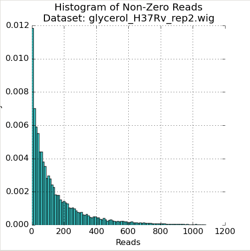
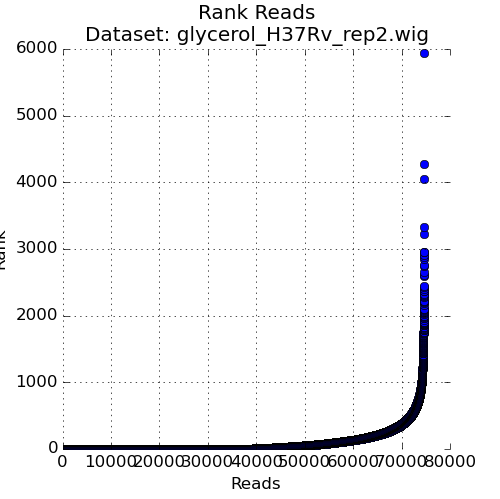

.. _transit_quality_control:

Quality Control
===============


TRANSIT has several useful features to help inspect the quality of datasets as
and export them to different formats. (see also :ref:`TPP Statistics <TPP_Statistics>` )


As you add datasets to the control or experimental sections, TRANSIT
automatically provides some metrics like density, average, read-counts and
max read-count to give you an idea of how the quality of the dataset.

However, TRANSIT provides more in-depth statistics in the Quality Control
window. To use this feature, add the annotation file for your organism
(in .prot_table or GFF3 format). Next, add and highlight/select the desired
read-count datasets in .wig format. Finally, click on View -> Quality Control.
This will open up a new window containing a table of metrics for the datasets
as well as figures corresponding to whatever dataset is currently highlighted.

.. image:: _images/transit_quality_control_window.png
   :width: 600
   :align: center


QC Metrics Table
~~~~~~~~~~~~~~~~

The Quality Control window contains a table of the datasets and metrics, similar
to the one in the main TRANSIT interface. This table has an extended set of
metrics to provide a better picture of the quality of the datasets:


=============  ==============================================  =============================================================================================================
Column Header  Column Definition                                 Comments
=============  ==============================================  =============================================================================================================
File           Name of dataset file.
Density        Fraction of sites with insertions.               "Well saturated" Himar1 datasets have >30% saturation. Beneath this, statistical methods may have trouble.
Mean Read      Average read-count, including empty sites.
NZMean Read    Average read-count, excluding empty sites.       A value between 30-200 is usually good for Himar1 datasets. Too high or too low can indicate problems.
NZMedian Read  Median read-count, excluding empty sites.        As read-counts can often have spikes, median serves as a good robust estimate.
Max Read       Largest read-count in the dataset.               Useful to determine whether there are outliers/spikes, which may indicate sequencing issues.
Total Reads    Sum of total read-counts in the dataset.         Indicates how much sequencing material was obtained. Typically >1M reads is desired for Himar1 datasets.
Skew           Skew of read-counts in the dataset.              Large skew may indicate issues with a dataset. Typically a skew < 50 is desired. May be higher when
                                                                library is under strong selection
Kurtosis       Kurtosis of the read-counts in the dataset.
=============  ==============================================  =============================================================================================================


QC Plots
~~~~~~~~

The Quality Control window also contains several plots that are helpful to
visualize the quality of the datasets. These plots are unique to the dataset
selected in the Metrics Table (below the figures). They will update depending
on which row in the Metrics Table is selected:

Figure 1: Read-Count Distribution
`````````````````````````````````





The first plot in the Quality Control window is a histogram of the non-zero read-counts in the selected dataset. While read-counts are not truly geometrically distributed, "well-behaved" datasets often look "Geometric-like", i.e. low counts are more frequent than very large counts. Datasets which where this is not the case may reflect a problem.


Figure 2: QQ-Plot of Read-Counts vs Geometric Distribution
``````````````````````````````````````````````````````````


.. image:: _images/transit_quality_control_qqplot.png
   :width: 600
   :align: center


The second plot in the Quality Control window is a quantile-quantile plot ("QQ plot") of the non-zero read-counts in the selected dataset, versus a theoretical geometric distribution fit on these read-counts. While read-counts are not truly geometrically distributed, the geometric distribution (a special case of the Negative Binomial distribution), can serve as a quick comparison to see how well-behaved the datasets are.


As the read-counts are not truly geometric, some curvature in the QQplot is expected. However, if the plot curves strongly from the identity line (y=x) then the read-counts may be highly skewed. In this case, using the "betageom" normalization option when doing statistical analyses may be a good idea as it is helpful in correcting the skew. 


Figure 3: Ranked plot of Read-Counts
````````````````````````````````````





The second plot in the Quality Control window is a plot of the read-counts in sorted order. This may be helpful in indentifying outliers that may exist in the dataset. Typically, some large counts are expected and some normalization methods, like TTR, are robust to such outliers. However, too many outliers, or one single outlier that is overhwelmingly different than the rest may indicate an issue like PCR amplification (especially in libraries constructed older protocols).


Interpretation of Data Quality
~~~~~~~~~~~~~~~~~~~~~~~~~~~~~~

It is important to be able to evaluate the quality of datasets.
In a nutshell, we look at statistics like saturation, and mean read count,
but also things like max count and skewness.

There are two ways to do QC in Transit - via the GUI and command-line.  
In the GUI, one can load a set of
wig files a select "View->Quality Control" in the menu; this will
display some plots of read-count distribution.  Ideally, you want most of
your datasets to fall along the diagonal on a QQ-plot.  Real data will
often deviate somewhat (I will try to be more quantitative about this in the future),
but if a dataset skews far off from the diagonal, it could cause problems
with analytical methods like resampling or the HMM.  

.. image:: http://saclab.tamu.edu/essentiality/transit/QC_example.png

You can also generate the same table to statistics as on the QC panel
from the command-line using the :ref:`tnseq_stats <tnseq_stats>` command.  

Below the plots are a table of statistics.  While there are not
rigorous criteria for defining "bad" datasets, rules of thumb I use
for "good" datasets are: density>30% (ideally >50%) and NZmean>10 (ideally >50).  
In addition, I look
at MaxReadCount and Skewness as indicators.  Typically, MaxReadCount
will be in the range of a few thousand to tens-of-thousands.  
If you see individual sites with
counts in the range of 10\ :sup:`5`\ -10\ :sup:`6` , it might mean you have some positive
selection at a site (e.g. biological, or due to PCR jackpotting), and
this can have the effect of reducing counts and influencing the
distribution at all the other sites.  If MaxReadCount<100, that is also
probably problematic (either not enough reads, or possibly skewing).
Also, skewness>30 often (but not
always) signals a problem.  Kurtosis doesn't seem to be very
meaningful.  The reason it is not easy to boil all these down to a
simple set of criteria is that some some of the metrics interact with
each other.  


.. _BGC:

Beta-Geometric Correction
~~~~~~~~~~~~~~~~~~~~~~~~~

If you have a "bad" or poorly-behaving or "skewed" dataset (e.g. with mostly low
counts, dominated by a few high counts), right now the only remedy you
can try is applying the **Beta-Geometric correction (BGC)**, which is a
non-linear adjustment to the insertion counts in a wig file to make
them more like an ideal Geometric distribution (`DeJesus & Ioerger, 2016 <https://www.ncbi.nlm.nih.gov/pubmed/26932272>`_). (Note, all the
other normalizations, like TTR, are linear adjustments, and so they
can't correct for skewing.)

In the GUI, when you are looking, you can change
the normalization (e.g. from TTR to betageom) using the drop-down.  Be aware that the Beta-Geometric
normalization is compute-intensive and might take few minutes.

If it looks like it might help (i.e. if the QQ-plot fits the diagonal better using BG
normalization),
you can created BG-corrected versions of individual wig files by
exporting them using the :ref:`normalize command <normalization>` 
on the command-line with '-n betageom' to specify normalization.

