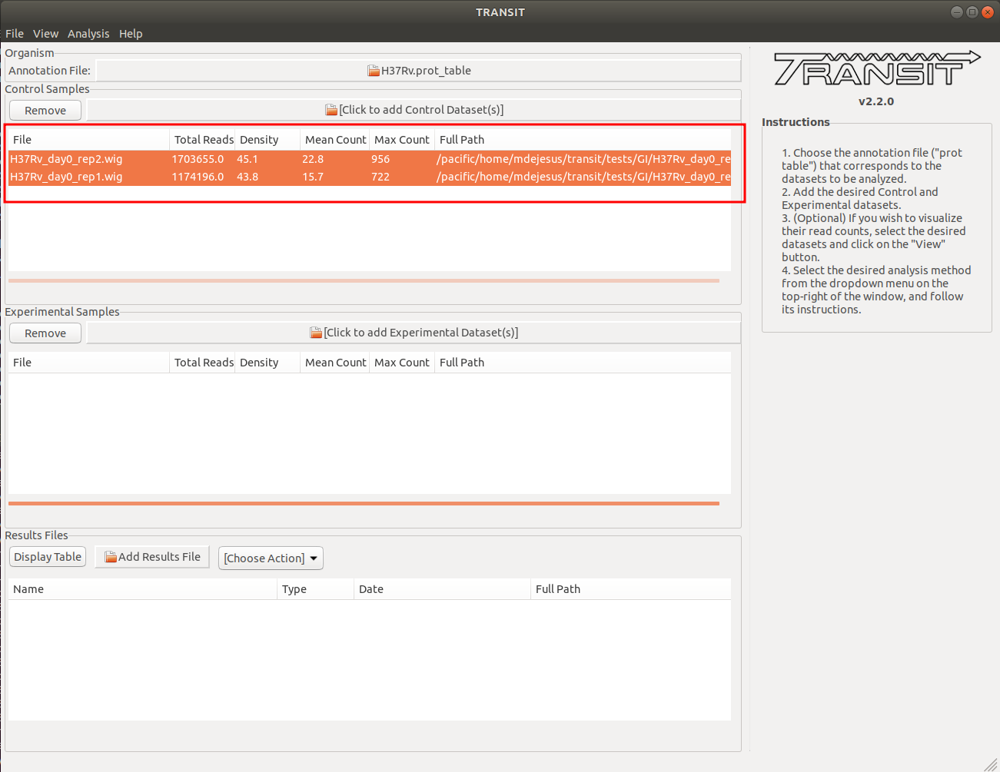
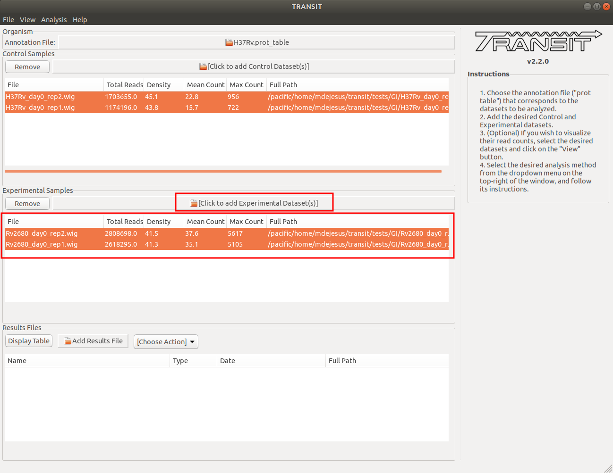
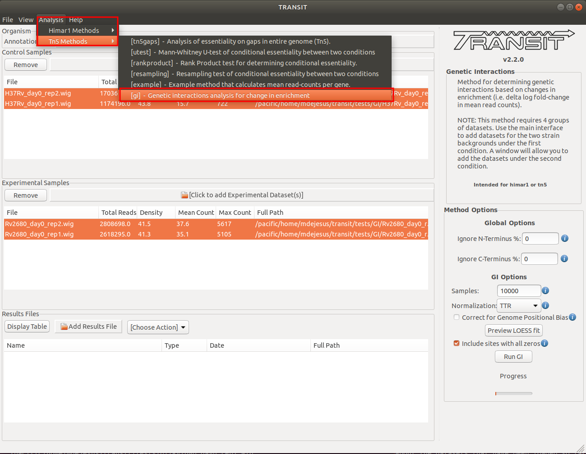
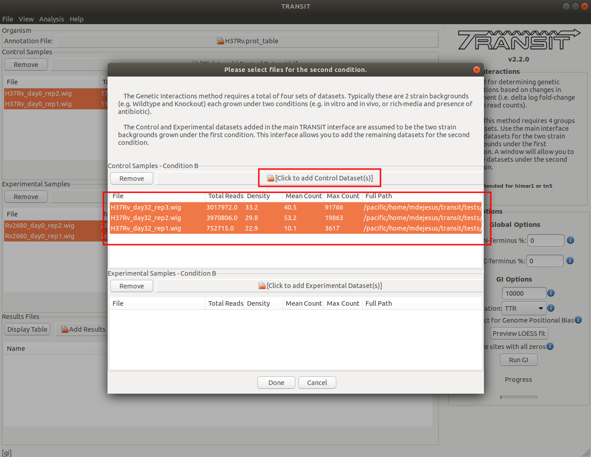
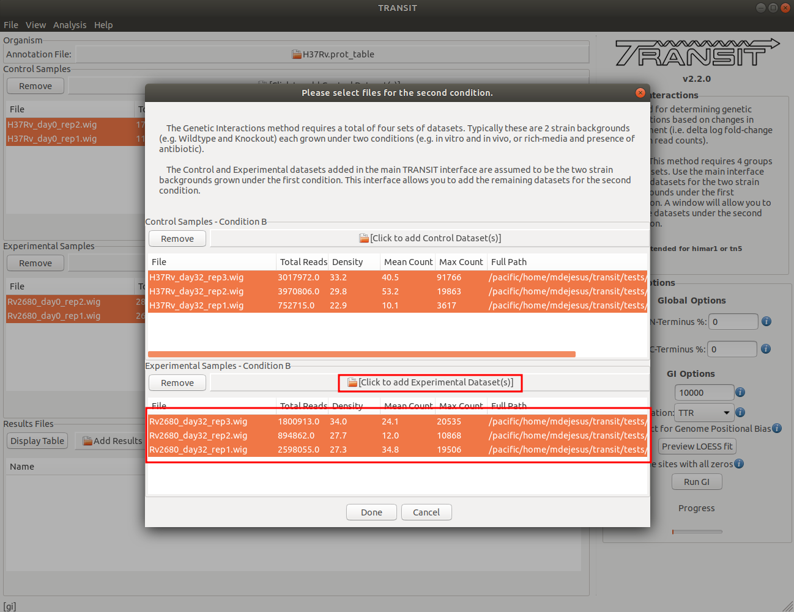

Tutorial: Genetic Interactions Analysis
=======================================

The feature implements the method derscribed in the following publication:

`DeJesus, M.A., Nambi, S., Smith, C.M., Baker, R.E., Sassetti, C.M.,
and Ioerger, T.R. (2017). Statistical Analysis of Genetic Interactions
in TnSeq Data. Nucleic Acids Research, 45(11):e93.
<https://www.ncbi.nlm.nih.gov/pubmed/28334803>`__

To illustrate how TRANSIT can be used to analyze genetic interactions,
we are going to go through a tutorial where we analyze datasets of 
*M. tuberculosis* in two different strain backgrounds (H37Rv, and 
delta-Rv2680 mutant), grown under two different conditions each 
(in-vivo day 0, and in-vivo day 32).


This tutorial provides instructions to accomplish the analysis in
either :ref:`Console Mode <console-mode-tutorial>` or :ref:`GUI Mode <gui-mode-tutorial>`.


.. _console-mode-tutorial:

Console Mode Tutorial
`````````````````````

The Genetic Interactions (GI) method can be run in Console Mode without
the need of the graphical interface. One can get an idea of how to run
the method as well as the necessary and optional arguments by simply
running the following command:

::

    python PATH/src/transit.py gi


In this tutorial, we're analyzing datasets of *M. tuberculosis* in 
the H37Rv reference strain and a delta-Rv2680 mutant strain, grown under two 
different conditions each (in-vivo day 0, and in-vivo day 32). The method
requires the comma-separated lists to the path of the .wig files. 

- The first list corresponds to the Control datasets in the first condition (i.e. H37Rv at day 0)

- The second list corresponds to the Control datasets in the second condition (i.e. H37Rv at day 32)


- The third list corresponds to the Experimental datasets in the first condition (i.e. delta-Rv2680 at day 0)

- The fourth list corresponds to the Experimental datasets in the second condition (i.e. delta-Rv2680 at day 32)


Below is an example command to run this analysis, assuming the files are in the same
directory where the files are located:

::

    python PATH/src/transit.py gi H37Rv_day0_rep1.wig,H37Rv_day0_rep2.wig H37Rv_day32_rep1.wig,H37Rv_day32_rep2.wig,H37Rv_day32_rep3.wig Rv2680_day0_rep1.wig,Rv2680_day0_rep2.wig Rv2680_day32_rep1.wig,Rv2680_day32_rep2.wig,Rv2680_day32_rep3.wig H37Rv.prot_table results_gi_Rv2680.dat -s 10000


|

|

.. _gui-mode-tutorial:

GUI Mode Tutorial
`````````````````

Run TRANSIT
-----------
Navigate to the directory containing the TRANSIT files, and run
TRANSIT (or run 'transit' if you installed as a package):

::

    
    python PATH/src/transit.py


Adding the annotation file
--------------------------
Before we can analyze datasets, we need to add an annotation file for
the organism corresponding to the desired datasets. Click on the file
dialog button, on the top of the TRANSIT window (see image below), and
browse and select the appropriate annotation file. Note: Annotation
files must be in ".prot_table" or GFF3 format.


.. image:: _images/transit_tutorial_annotation.png
   :width: 600
   :align: center


Adding datasets grown under *condition A*
-----------------------------------------

The analysis of genetic interactions requires four sets of data. 
The TRANSIT interface allows for two sets of data at a time: 
Control and Experimental. For the purposes of genetic interactions, 
the initial set will represent the two strains under the first
condition.

Adding the *control* datasets in *condition A*
~~~~~~~~~~~~~~~~~~~~~~~~~~~~~~~~~~~~~~~~~~~~~~

In this context, the Control datasets in the first condition are the
datasets for the H37Rv reference strain at day 0. To add these, 
we click on the control sample file dialog (see image below), and 
select the desired datasets (one by one). In this example, we have two replicates:





As we add the datasets they will appear in the table in the Control
samples section. This table will provide the following statistics
about the datasets that have been loaded so far: Total Number of
Reads, Density, Mean Read Count and Maximum Count. These statistics
can be used as general diagnostics of the datasets.


Adding the *experimental* datasets in *condition A*
~~~~~~~~~~~~~~~~~~~~~~~~~~~~~~~~~~~~~~~~~~~~~~~~~~~
We now repeat the process we did for control samples, for the
experimental datasets. In this tutorial, the experimental datasets
come from the Knock0out strain, delta-Rv2680, and the first condition,
in-vivo day 0. To add these, we click on the experimental sample file dialog 
(see image below), and select the desired datasets (one by one). 
In this example, we have
two replicates:




Running the Genetic Interactions method
---------------------------------------

We are now ready to proceed with the genetic interactions (GI)
method in TRANSIT. In the menu bar, click on Analysis =>
[gi] to selected the GI method. The panel on the right-hand
side will populate with options. The analysis of genetic interactions 
requires four sets of data. After you are done setting
these options are desired, click on the "Run GI" button. This will open
a new window that will allow you to add the remaining two
sets of data grown under the second condition:





Adding the *control* datasets in *condition B*
~~~~~~~~~~~~~~~~~~~~~~~~~~~~~~~~~~~~~~~~~~~~~~

In this context, the Control datasets in the second condition (B) are 
the datasets for the H37Rv reference strain at day 0. To add these,
we click on the control sample file dialog in the window that opened
after clicking the "Run" button (see image below), and
select the desired datasets (one by one). 
In this example, we have three replicates:





As we add the datasets they will appear in the table in the Control
samples section. This table will provide the following statistics
about the datasets that have been loaded so far: Total Number of
Reads, Density, Mean Read Count and Maximum Count. These statistics
can be used as general diagnostics of the datasets.


Adding the *experimental* datasets in *condition B*
~~~~~~~~~~~~~~~~~~~~~~~~~~~~~~~~~~~~~~~~~~~~~~~~~~~
We now repeat the process we did for control samples, for the
experimental datasets. In this tutorial, the experimental datasets
come from the Knock0out strain, delta-Rv2680, and the first condition,
in-vivo day 32. To add these, we click on the experimental sample file dialog
(see image below), and select the desired datasets (one by one).
In this example, we have
two replicates:




Viewing GI results
------------------
Once TRANSIT finishes running, the results file will automatically be
added to the Results Files section at the bottom of the window.
To view the actual results, we can open the file in a new window by
selecting it from the list and clicking on the "Display Table" button.


The newly opened window will display a table of the results. We can
sort the results by clicking on the column header. For example, to
focus on the genes that are most likely to be interacting with Rv2680 
(i.e. the gene Knocked out) we can click on the column header
labeled "Type of Interaction", which represents the final classification
by the GI method.

You can also sort by "Mean delta logFC" to see the estimated change
in enrichment between the two strains and conditions.


