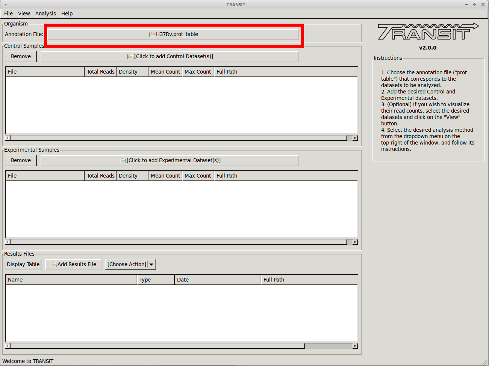
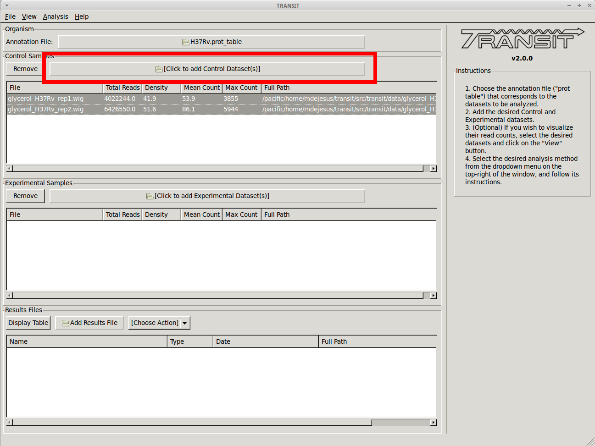

Tutorial: Normalize datasets
============================

TRANSIT has the capability to normalize datasets with different methods,
and export them to `IGV from the Broad Institute <https://www.broadinstitute.org/igv/>`_
or a CombinedWig format. This tutorial shows a quick overview of how
to normalize datasets save them using the GUI mode of transit or through
the Console mode.

|

Adding the annotation file
--------------------------
Before we can normalize .wig datasets, we need to add an
annotation file for the organism. Click on the file dialog button, on
the top of the TRANSIT window (see image below), and browse and select
the appropriate annotation file. Note: Annotation files must be in
".prot_table" or GFF3 format, described above:

Add .wig datasets
-----------------
Next we must choose to add .wig formatted datasets what we wish to
normalize to CombinedWig format. To add these, we click on the control sample
file dialog (see image below), and select the desired datasets (one by
one). In this example, we have two replicates:

As we add the datasets they will appear in the table below. Select the datasets
you wish to normalize.

Normalize and Save
------------------
After you have selected the desired datasets in the list of datasets added,
click on "Export -> Selected Datasets" in the menu bar at the top of the TRANSIT
window, and select the format you desire (e.g. "to IGV" or "to CombinedWig").
You will be prompted to pick a normalization method, and a filename.
Note: Only selected datasets ("Control+Click") will be normalized and
saved.

.. image:: _images/transit_tutorial_norm_options.png
   :width: 600
   :align: center

|

.. _normalization:

Normalization
-------------

Proper normalization is important as it ensures that other sources of variability are not mistakenly treated
as real differences in datasets. TRANSIT provides various normalization methods, which are briefly described below:

- **TTR:**
    Trimmed Total Reads (TTR), normalized by the total
    read-counts (like totreads), but trims top and bottom 5% of
    read-counts. **This is the recommended normalization method for most cases**
    as it has the beneffit of normalizing for difference in
    saturation in the context of resampling.

- **nzmean:**
    Normalizes datasets to have the same mean over the
    non-zero sites.

- **totreads:**
    Normalizes datasets by total read-counts, and scales
    them to have the same mean over all counts.

- **zinfnb:**
    Fits a zero-inflated negative binomial model, and then
    divides read-counts by the mean. The zero-inflated negative
    binomial model will treat some empty sites as belonging to the
    "true" negative binomial distribution responsible for read-counts
    while treating the others as "essential" (and thus not influencing
    its parameters).

- **quantile:**
    Normalizes datasets using the quantile normalization
    method described by `Bolstad et al.
    (2003) <http://www.ncbi.nlm.nih.gov/pubmed/12538238>`_. In this
    normalization procedure, datasets are sorted, an empirical
    distribution is estimated as the mean across the sorted datasets
    at each site, and then the original (unsorted) datasets are
    assigned values from the empirical distribution based on their
    quantiles.

- **betageom:**
    Normalizes the datasets to fit an "ideal" Geometric
    distribution with a variable probability parameter *p*. Specially
    useful for datasets that contain a large skew.

- **nonorm:**
    No normalization is performed.

