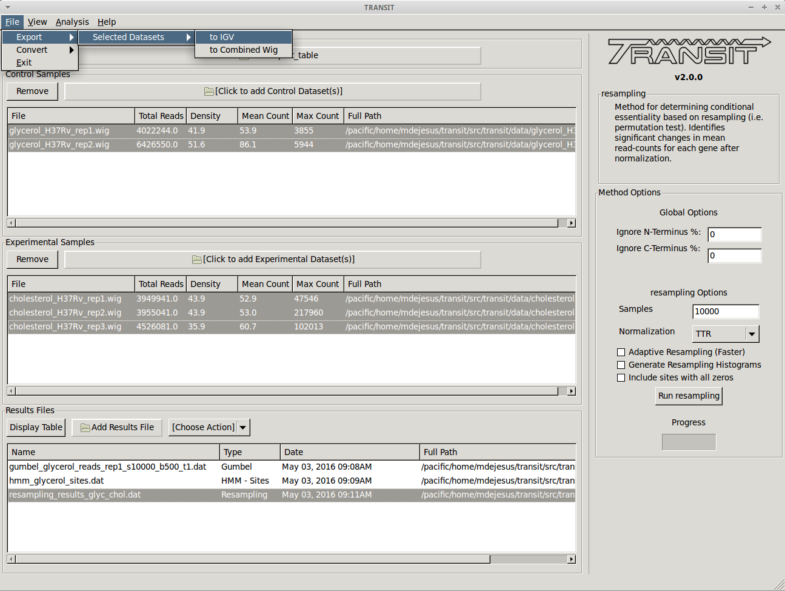

Tutorial: Export datasets
=========================

TRANSIT has the capability to export .wig files into different formats.
This tutorial shows a quick overview of how to export to the IGV format.
This can be useful to be able to import read-count data into
`IGV from the Broad Institute <https://www.broadinstitute.org/igv/>`_ and use
its visualization capabilities.

|

Adding the annotation file
--------------------------
Before we can export .wig datasets to IGV format, we need to add an
annotation file for the organism. Click on the file dialog button, on
the top of the TRANSIT window (see image below), and browse and select
the appropriate annotation file. Note: Annotation files must be in
".prot_table" or GFF3 format, described above:

.. image:: _images/transit_tutorial_annotation.png
   :width: 600
   :align: center

Add .wig datasets
-----------------
Next we must choose to add .wig formatted datasets what we wish to
export to IGV format. To add these, we click on the control sample
file dialog (see image below), and select the desired datasets (one by
one). In this example, we have two replicates:

.. image:: _images/transit_tutorial_control_datasets.png
   :width: 600
   :align: center

As we add the datasets they will appear in the table below.

Export to IGV
-------------
Finally, to export the datasets we click on "Export" in the menu bar
at the top of the TRANSIT window, and select the option that matches
which datasets we wish to export. Note: Only selected datasets
("Control+Click") will be exported.

