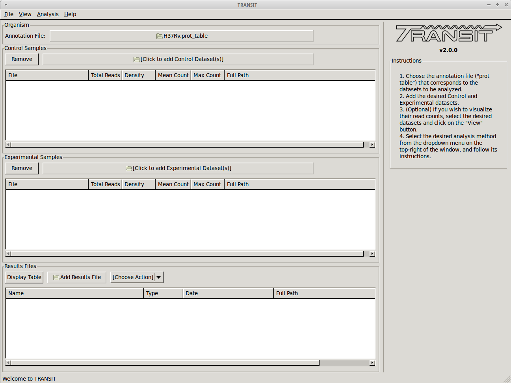
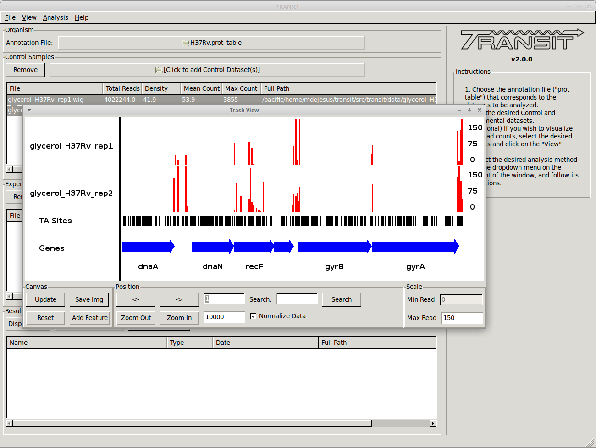
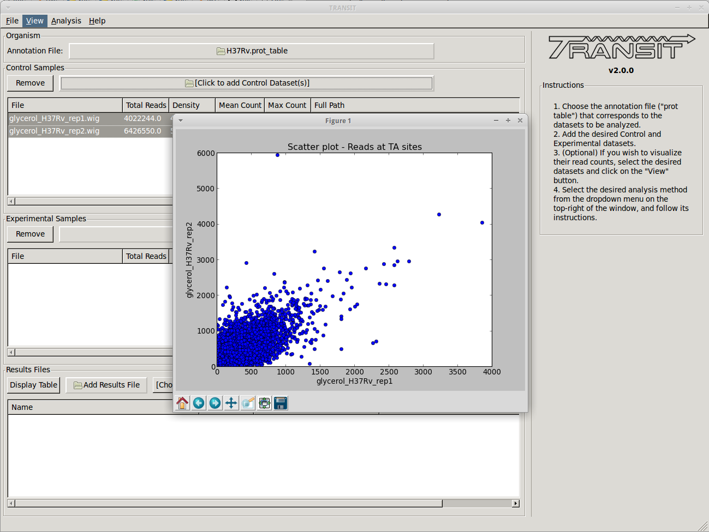
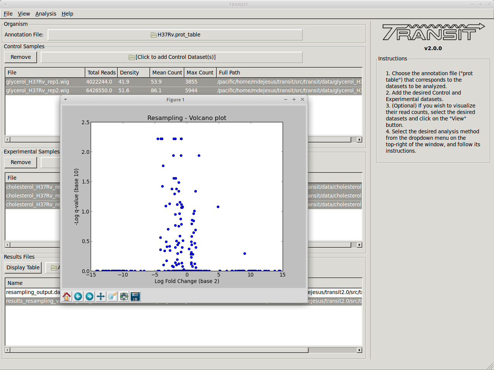
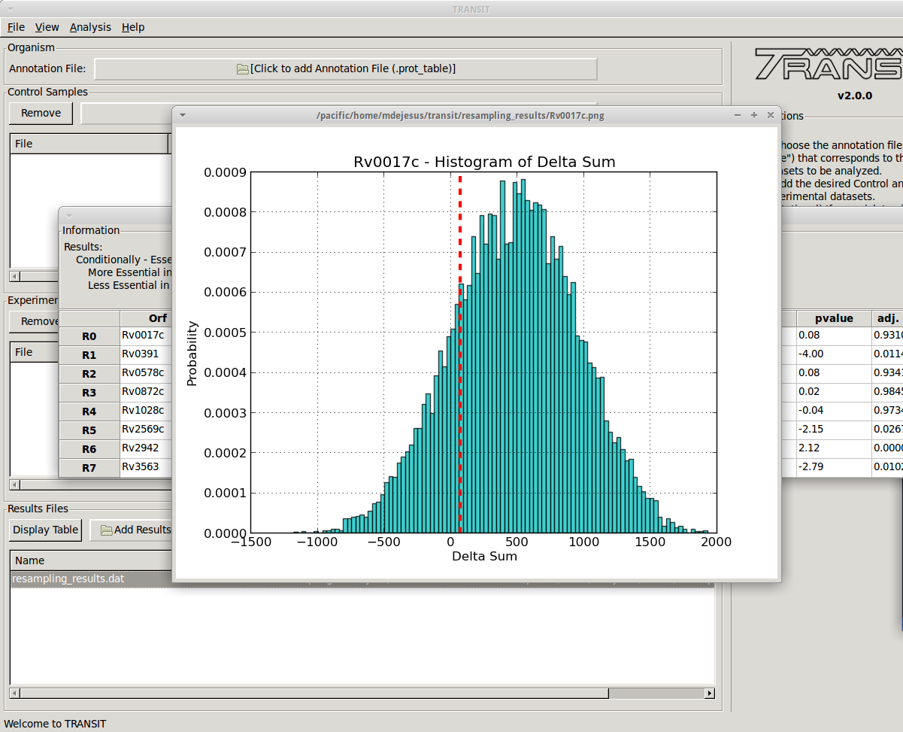

TRANSIT Overview
================

The analysis methods in Transit are also described in this `PDF manual
<https://orca1.tamu.edu/essentiality/transit/transit-manual.pdf>`_ .

+ This is a software that can be used to analyze Tn-Seq datasets. It includes various statistical calculations of essentiality of genes or genomic regions (including conditional essentiality between 2 conditions). These methods were developed and tested as a collaboration between the Sassetti lab (UMass) and the Ioerger lab (Texas A&M) [DeJesus2015TRANSIT]_.

|

+ TRANSIT is capable of analyzing TnSeq libraries constructed with Himar1 or :ref:`Tn5 <tn5-main-overview>` datasets.

|

+ TRANSIT assumes you have already done pre-processing of raw sequencing files (.fastq) and extracted read counts into a `.wig formatted file <http://genome.ucsc.edu/goldenpath/help/wiggle.html>`_. The .wig file should contain the counts at all sites where an insertion could take place (including sites with no reads). For Himar1 datasets this is all TA sites in the genome. For :ref:`Tn5 <tn5-main-overview>` datasets this would be all nucleotides in the genome.

|

+ Note that while refer to "read-counts" throughout the documentation, the `current Himar1 protocol <http://www.springer.com/biomed/human+genetics/book/978-1-4939-2397-7>`_ utilizes internal barcodes that can be used to reduce raw read counts to unique template counts, and this this is the intended input to TRANSIT from Himar1 datasets.

|

+ There are various methods available for pre-processing (converting .fastq files to .wig files). You might have your own scripts (if so, massage the data into .wig format), or you might get the scripts used in the Sassetti lab. For convenience, we are including a separate tool called `TPP <http://saclab.tamu.edu/tom/TPP.html>`_ (Tn-Seq Pre-Processor) with this distribution that encodes the way we process .fastq files in the Ioerger lab. It's a complicated process with many steps (removing transposon prefixes of reads, mapping into genome, identifying barcodes and reducing read counts to template counts).

|

+ Most of the analysis methods in TRANSIT require an **annotation** to know the gene coordinates and names. This is the top file input in the GUI window. The annotation has to be in a somewhat non-standard format called a ".prot_table". If you know what you are doing, it is easy to convert annotations for other organisms into .prot_table format. But for convenience, we are distributing the prot_tables for 3 common versions of the H37Rv genome: H37Rv.prot_table (NC_000962.2, from Stewart Cole), H37RvMA2.prot_table (sequenced version from the Sassetti lab), and H37RvBD.prot_table (sequenced by the Broad Institute). All of these are slightly different, and it is **critical** that you use the same annotation file as the reference genome sequence used for mapping the reads (during pre-processing).
|
+ There are three main types of essentiality analyses: individual,
  comparative (pairwise), and multi-condition. 

  + In *individual analysis*, the goal is to distinguish essential vs. non-essential in a single growth condition, and to assess the statistical significance of these calls. Two methods for this are the :ref:`Gumbel <gumbel>` method and the :ref:`HMM <HMM>`. They are computationally distinct. The Gumbel method is looking for significant stretches of TA sites lacking insertions, whereas the HMM looks for regions where the mean read count is locally suppressed or increased. The HMM can detect 'growth-advantaged' and 'growth-defect' regions. The HMM is also a bit more robust on low-density datasets (with insertion density as low as 20-30%). But both methods have their merits and are complementary.

|

  + For *comparative analysis*, the goal is to determine if the sum of read counts differs significantly between two conditions, for which TRANSIT uses :ref:`resampling<resampling>` (a non-parameteric test analogous to a permutation test). Hence this can be used to identify conditionally essential regions and quantify the statistical significance.  A rank-based Mann-Whitney U-test is also available.

|

  + For *multi-condition analysis*, there are two methods for determining whether insertion counts in a gene vary significantly across conditions: :ref:`ZINB <zinb>` (Zero-Inflated Negative Binomial) regression, and :ref:`ANOVA <anova>`.  In general, we find that ZINB finds more (and better) hits than ANOVA (and even out-performs resampling, for cases with 2 conditions).  Futhermore, ZINB can incorporate additional covariates.

|

+ TRANSIT has been designed to handle multiple replicates. If you have two or more replicate dataset of the same library selected in the same condition, you can provide them, and more of the computational methods will do something reasonable with them.

|

+ For those methods that generate p-values, we often also calculate adjusted p-value (or 'q-values') which are corrected for multiple tests typically the Benjamini-Hochberg procedure. A typical threshold for significance would be q<0.05 (not p<0.05).

|

+ It is important to understand the GUI model that TRANSIT uses It allows you to load up datasets (.wig files), select them, choose an analysis method, set parameters, and start the computation. It will generate **output files** in your local directory with the results. These files can then be loaded into the interface and browser with custom displays and graphs. The interface has 3 main windows or sections: 'Control Samples', 'Experimental Samples', 'Results Files.' The first two are for loading input files ('Control Samples' would be like replicate datasets from a reference condition, like in vitro, rich media, etc.; 'Experimental Samples' would be where you would load replicates for a comparative conditions, like in vivo, or minimal media, or low-iron, etc.) The 'Results Files' section is initially empty, but after a computation finishes, it will automatically be populated with the corresponding output file. See the 'Tutorial' section below in this documentation for an illustration of the overall process for a typical work-flow.

|

+ TRANSIT incorporates many interesting ways of looking at your data.

|

    + Track view shows you a visual representation of the read counts at each site at a locus of interest (for selected datasets) somewhat like IGV.

|

    + Scatter plots can show the correlation of counts between 2 datasets.

|
    + Volcano plots can be used to visualize the results of resampling and assess the distribution between over- and under-represented genes in condition B vs. condition A. In addition you can look at histogram of the resampling distributions for each gene.

+ Most of the methods take a few minutes to run. (it depends on parameters, CPU clock speed, etc., but the point is, a) these calculations are complex and not instaneous, but b) we have tried to implement it so that they don't take hours)

+ Note: in this version of TRANSIT, most of the methods are oriented toward gene-level analysis. There are methods for analyzing essentiality of arbitrary genomic regions (e.g. sliding windows, HMMs...). We plan to incorporate some of these in future versions.

Developers
----------

=======================  ============  ==============================================================================
 Name                    Time Active          Contact Information
=======================  ============  ==============================================================================
Thomas R. Ioerger        2015-Present  `http://faculty.cs.tamu.edu/ioerger/ <http://faculty.cs.tamu.edu/ioerger/>`_
Michael A. DeJesus       2015-2018     `http://mad-lab.org <http://mad-lab.org>`_
Chaitra Ambadipudi       2015
Eric Nelson              2016
Siddharth Subramaniyam   2018
=======================  ============  ==============================================================================

References
----------

If you use TRANSIT, please cite the following reference:

.. [DeJesus2015TRANSIT] `DeJesus, M.A., Ambadipudi, C., Baker, R., Sassetti, C., and Ioerger, T.R. (2015). TRANSIT - a Software Tool for Himar1 TnSeq Analysis. PLOS Computational Biology, 11(10):e1004401 <http://journals.plos.org/ploscompbiol/article?id=10.1371/journal.pcbi.1004401>`_

Development of TRANSIT is funded by the National Institutes of Health (www.nih.gov/) grant U19 AI107774.

Other references for methods utilized by TRANSIT:

.. [DeJesus2013]  `DeJesus, M.A., Zhang, Y.J., Sassettti, C.M., Rubin, E.J.,
  Sacchettini, J.C., and Ioerger, T.R. (2013). Bayesian analysis of gene essentiality based on sequencing of transposon insertion libraries. Bioinformatics, 29(6):695-703. <http://www.ncbi.nlm.nih.gov/pubmed/23361328>`_

.. [DeJesus2013HMM] `DeJesus, M.A., Ioerger, T.R. A Hidden Markov Model for identifying essential and growth-defect regions in bacterial genomes from transposon insertion sequencing data. BMC Bioinformatics. 2013. 14:303 <http://www.ncbi.nlm.nih.gov/pubmed/24103077>`_

.. [DeJesus2014] `DeJesus, M.A. and Ioerger, T.R. (2014). Capturing uncertainty by modeling local transposon insertion frequencies improves discrimination of essential genes. IEEE Transactions on Computational Biology and Bioinformatics, 12(1):92-102. <http://www.ncbi.nlm.nih.gov/pubmed/26357081>`_

.. [DeJesus2016] `DeJesus, M.A. and Ioerger, T.R. (2016). Normalization of transposon-mutant library sequencing datasets to improve identification of conditionally essential genes. Journal of Bioinformatics and Computational Biology, 14(3):1642004 <http://www.ncbi.nlm.nih.gov/pubmed/26932272>`_

.. [DeJesus2017NAR] `DeJesus, M.A., Nambi, S., Smith, C.M., Baker, R.E., Sassetti, C.M., Ioerger, T.R. Statistical analysis of genetic interactions in Tn-Seq data.  Nucleic Acids Research. 2017. 45(11):e93. doi: 10.1093/nar/gkx128. <https://www.ncbi.nlm.nih.gov/pubmed/28334803>`_

.. [ZINB] `Subramaniyam S, DeJesus MA, Zaveri A, Smith CM, Baker RE, Ehrt S, Schnappinger D, Sassetti CM, Ioerger TR. (2019).  Statistical analysis of variability in TnSeq data across conditions using Zero-Inflated Negative Binomial regression. *BMC Bioinformatics*. 2019 Nov 21;20(1):603. doi: 10.1186/s12859-019-3156-z. <https://bmcbioinformatics.biomedcentral.com/articles/10.1186/s12859-019-3156-z>`_

.. [Choudhery2021] `Choudhery S, Brown AJ, Akusobi C, Rubin EJ, Sassetti CM, Ioerger TR. Modeling Site-Specific Nucleotide Biases Affecting Himar1 Transposon Insertion Frequencies in TnSeq Data Sets. *mSystems*. 2021 Oct 26;6(5):e0087621. doi: 10.1128/mSystems.00876-21. <https://pubmed.ncbi.nlm.nih.gov/34665010/>`_
